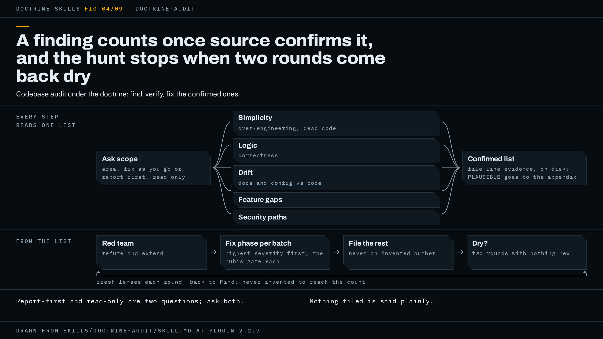

# doctrine-audit

A codebase audit under the doctrine: it finds real issues, verifies each one against source, and fixes the confirmed ones or hands you a report, whichever you asked for.



The figure shows the shape: parallel finders on the left, one confirmed list in the middle that every later step reads, and a fix phase per batch of issues, each with its own gate.

## When to use it, and when not

The trigger is a bug hunt or a deep code audit: you want drift, feature gaps, logic issues, over-engineering and bugs found across an area of the codebase, with parallel finder waves, red-teaming, and looping until dry. You do not have one failure in hand. You suspect a region and want it swept.

The other wrappers cover the neighbouring cases. If something is already broken, throwing, failing or slow, that is `doctrine-debug`: it starts from a symptom, where this skill starts from a scope. If you want a feature built or a spec implemented, that is `doctrine-code`. If the problem is documentation that has fallen behind the code, that is `doctrine-docs`. This skill has a drift lens that reports where docs and config disagree with code, but a documentation sweep is a different job with a different gate.

The hub is not for one-off questions or single-file edits, and the same holds here. A one-file scope is fine as a first run, and the README shows one. A question you could answer by reading the file yourself is not a job for it.

## What it asks you first

Before any finder is dispatched, the agent asks whatever your request left open, on three topics: the target area, whether to fix as it goes or report first, and the severity or effort line above which an issue is filed on your tracker rather than fixed. The exact wording is not scripted by the specification, only the topics.

Report-first and read-only are two separate questions, and it asks both. Report-first means do not fix. Read-only means do not write anything to the repo, the working tree included. A user who says "report only, don't touch the repo" is answering both, and the run must not commit a report file into the repo it was told not to touch. Where you say read-only, or the agent has no write authority, the report is built in the scratchpad and handed over.

Your answers are written to disk, in the same file the confirmed list will go in, before the first wave. The doctrine calls the verbatim version of your words the anchor, and it goes to every seat that judges work against intent. This wrapper goes one step further: the rulings that bind a seat's conduct, report-first, read-only, and scope, go into every finder, fixer and reviewer prompt, because a finder is not a judging seat and would otherwise never be told the tree is read-only.

If your request leaves a direction question open, one where the work would be aimed differently depending on the answer, the run blocks on it rather than picking a default.

## How the work runs

The wrapper maps its seven-step flow onto the hub's posture. Doctrine step 1 is the questions above, and the record they open. Doctrine step 2 is how the finders are dispatched: parallel seats, each with an assembled prompt rather than a summary of the task.

Find. Finder waves go out in parallel, each seat holding one lens: simplicity (over-engineering and dead code), logic and correctness, drift between docs or config and code, feature gaps, and security-sensitive paths. The simplicity lens applies ponytail's audit posture if that plugin is installed, scoped to your target area rather than the whole repo, and the orchestrator resolves that posture into the lens prompt itself, since a dispatched seat cannot load a skill by name. Every finding needs file and line evidence. Findings are deduplicated across waves.

Verify. Nothing counts until it is confirmed from source. Hunt-style findings have a high false-positive rate, and a finding nobody traced to a line is noise. Items that stay only plausible are not fixed; they go to the report's appendix, or to a tracker issue marked unverified. As each finding is confirmed it is appended to the confirmed list on disk, one line per issue: an id, `file:line`, severity, the evidence that confirmed it, and its state (confirmed, red-teamed, fixed, filed, or declined). Steps 4, 5 and 6 read this list and nothing else produces it. A second, orchestrator-only file beside it carries the counters, including the dry-round count. Both exist because a long audit compacts between rounds, and a list that lived only in context comes back empty: round 3's finders re-file what round 1 fixed, and the dry count restarts at zero.

Red team. The confirmed list goes to the red team under doctrine step 4, to refute what is on it and to extend it. Anything the red team adds is verified the same way.

Fix. In fix-as-we-go mode, confirmed issues are grouped into phases, highest severity first, and each phase runs under the hub's gate from doctrine step 5. Anything with a non-obvious root cause goes through Matt Pocock's `diagnosing-bugs`. Everything above your severity or effort line is filed on the project's tracker, whatever its CLAUDE.md names. In report-first mode this step edits nothing and opens no fix phase, but filing still happens, because filing is a tracker write and not a fix, and in report-first mode every confirmed issue is filed, not only those above your line. If the tracker lives inside the repo and you ruled read-only, those items are listed in the report as unfiled and the report says so. Where there is no tracker at all, the agent checks the project's conventions, asks you if there are none, and otherwise carries the full list in the report and states plainly that nothing was filed. It never invents an issue number and never drops a finding for having nowhere to go.

Loop until dry. The find and verify steps repeat with fresh lenses until two consecutive rounds surface no new confirmed issue. That test, "nothing new", is the right one for this outer loop and only here. Inside each fix phase the hub's gate applies as written, where a pass is clean only when nothing is outstanding. A later round's findings open new fix phases or new report entries; they do not reopen closed ones. If the agent runs out of meaningful lenses before two dry rounds, it says so and stops rather than inventing lenses to satisfy the counter.

Deliver. Doctrine step 6, the simplification pass, runs inside each fix phase before its certifying pass. Doctrine step 7 lands the work by your repo's norm. Larger architectural refactors that surface along the way are not done mid-audit: they go through Matt Pocock's `improve-codebase-architecture` where it is installed, or are filed as issues.

## What the gate is for this shape

The hub says a wrapper supplies four things: the core discipline, the designated review, the red team's axes, and where the record lives.

The core discipline is the find, verify, fix cycle above, with `diagnosing-bugs` on any fix whose root cause is not obvious. Without that skill, the hub's fallback is inline: reproduce first, write the regression test before the fix.

The designated review for fix phases is `matts-code-review`. Two things about pointing it fall to the agent, and the run is wrong if either is skipped. It pins the fixed point to the SHA the fix phase started from, captured with `git rev-parse HEAD` before the phase's first edit, never `main` and never the merge-base: with no fixed point the review stops and asks you, twice a phase, and with a branch ref it re-reviews every fix phase already closed and re-files their findings, which the gate then counts as outstanding, so no pass can come clean. It also needs a spec source, the confirmed-list entries this phase is fixing or the tracker issues filed for them; without one its Spec sub-agent skips and the review runs one axis of two. Issue references resolve only where Matt's `docs/agents/issue-tracker.md` exists; otherwise pass the path. Without `matts-code-review` installed, the hub substitutes `/code-review`, or two parallel subagents (Standards and Spec) handed the same inputs.

In report-first mode the report is the deliverable, and it carries the hub's gate in one phase under the prose-deliverable exit: one clean pass by default, and if none has come by the round alarm's first firing, one closing round scoped to the diff since the last fully reviewed revision, then Shipped at an escalation with a punch list. The designated-review slot there is a fresh-context review of the finished report against the anchor and the confirmed list, because `matts-code-review` reads a diff and report-first produces none. The native checks take the docs-only form: every claim in the report re-verified against source, plus a path check.

The red team is the `codex:codex-rescue` seat, a different model, or a fresh-context subagent prompted to refute where the codex plugin is absent. Its axes here are the two the wrapper names: refute the confirmed list, and extend it. In report-first it is handed the finished report as well. Its return has to separate blocking from non-blocking and list what it attacked and could not break; a "no findings" with no attack list is a failed seat.

The record lives in two files. The first holds your answers and the confirmed list, at the report's own path where step 1 settled one, else a run-state file beside the work or in the scratchpad, named in the report. The second is orchestrator-only and holds the counters. The hub's two alarms bound every fix phase: the round alarm at every Nth round that found a blocker, N your figure or 4, and the time alarm at your budget or two hours, and either stops the loop with a diagnosis for you to rule on.

## A worked example

This example is illustrative: it shows the shape of a run, not a recorded one.

You type `use doctrine-audit on src/importer.ts (scope is that file only)`. The agent has the target, so it asks the three questions the request left open: fix as you go or report first, read-only or not, and the line above which issues are filed. You answer fix-as-we-go, writes allowed, and file anything that needs a schema change. It writes those answers and your request into the record, records the alarm defaults, and dispatches wave 1: five finders, one lens each, every prompt carrying the scope ruling.

The finders return findings with `file:line` evidence. The agent verifies each against source. Two confirm and one stays plausible, so the confirmed list reads:

```text
A1  src/importer.ts:88   high  duplicate header silently overwrites a field  confirmed
A2  src/importer.ts:140  low   dead branch, unreachable after the 2.x parser  confirmed
```

The plausible item goes to the appendix. The list goes to the red team, which refutes nothing and adds A3, a null path at line 61; the agent traces it and confirms it.

Fix phase 1 opens on A1 and A3. The agent records `git rev-parse HEAD` as the fixed point, fixes both, runs every check your repo documents, runs `matts-code-review` pinned to that SHA with the two list entries as its spec, and sends the diff to the red team. A blocking finding comes back on the A1 repair; the class question asks where else the same header handling appears, and the answer is one more call site, so the fix moves to the shared function. The next pass comes clean with one end-to-end run on record, and the phase's gate line reads:

```text
Gate: clean pass on 4a3e4ca, real run on record. No blockers open.
```

A2 needs a schema change, so it is filed as #212 rather than fixed. Round 2 goes out with fresh lenses and confirms nothing new. Round 3 confirms nothing new. Two dry rounds, so the loop is dry.

The report puts the gate line first, then walks your request item by item: the file audited, A1 and A3 fixed and certified, A2 filed as #212, the appendix of plausible items, the deferred list of non-blocking improvements, the record's path and its final state, and the commit or PR by your repo's norm. Had you answered report-first instead, no fix phase would open, the report would go where your project keeps reports, A1 through A3 would all be filed, and the gate line would describe the report's own single phase.

## How to invoke it

Ask for a bug hunt or a deep code audit done with the doctrine, and name the area. The README's own line is the smallest useful start:

```text
use doctrine-audit on src/whatever.ts (scope is that file only)
```

A fuller prompt: `Run doctrine-audit on packages/billing, report-first, read-only. I want drift between the docs and the code, and anything that writes a price.`

## Requirements

Nothing has to be installed. Each external skill this wrapper names has a fallback, in the hub's table or inline in the wrapper.

- Matt Pocock's `code-review`, installed by you as a renamed `matts-code-review` copy because the original name collides with Claude Code's `/code-review`. Without it: `/code-review`, or two parallel review subagents.
- Matt Pocock's `diagnosing-bugs`. Without it: inline, reproduce first and regression test before the fix.
- Matt Pocock's `improve-codebase-architecture`. Without it: architectural refactors are filed as tracker issues.
- ponytail, for the simplicity lens and the step 6 review. Without it: a manual YAGNI and dead-code read that reports and changes nothing for the lens, and `/simplify` or a manual pass for step 6.
- The OpenAI codex plugin, for the different-model red team. Without it: a fresh-context subagent prompted to refute, and the report names it as a same-model substitute.
- superpowers, for parallel dispatch and worktrees. Without it: parallel Agent tool calls.
- session-memory, for handoffs. Without it: the agent writes the handoff itself.

Install commands and the full list are in [`docs/requirements.md`](../requirements.md). To watch the finders and reviewers while they run, see [watching a run](../watching-a-run.md).

## Red flags

Signs a run has gone wrong, in your terms:

- You said report-first and the agent fixed findings instead of reporting and filing them.
- A report file was committed into a repo you said not to touch.
- The confirmed list never reached disk, so round 3 re-filed what round 1 fixed and every round looked productive.
- A compaction reset the dry-round count, so "two dry rounds" was one.
- The report cites an issue number that was never filed anywhere.
- A finding vanished because your project named no tracker.
- A plausible item was fixed as though it were confirmed. A fix is a change to working code.
- Lenses were invented to reach two dry rounds.
- `matts-code-review` was pointed at `main`, re-filing findings from fix phases that already closed.

The hub's page is [doctrine.md](doctrine.md), and the README's summary of the whole plugin is [`README.md`](../../README.md).

The specification is [`skills/doctrine-audit/SKILL.md`](../../skills/doctrine-audit/SKILL.md); trust it over this page wherever the two disagree.
