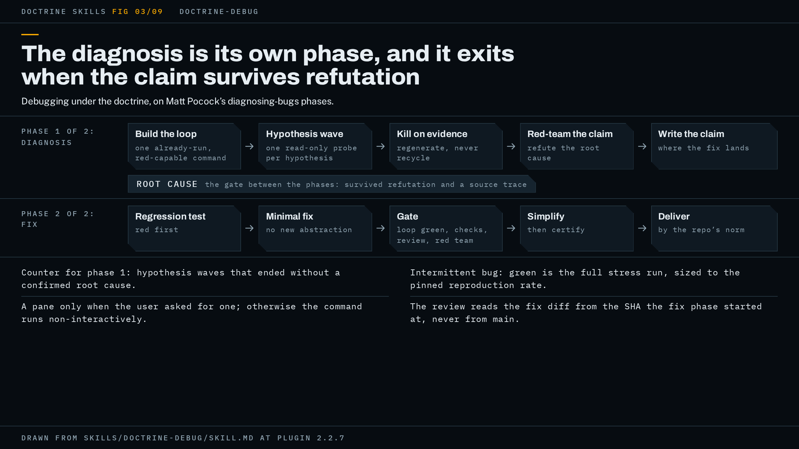

# doctrine-debug

Diagnosing and fixing one reported defect under the doctrine: a feedback loop first, parallel hypothesis probes, a red team on the diagnosis before any fix is written, and a gate on the fix.



The figure shows the two phases and where the gate sits between them.

## When to use it, and when not

Use it when you can point at something that is broken, throwing, failing or slow, and you want it diagnosed and fixed rather than only found. The trigger in the skill's description is a report of a defect plus a request to fix it with the doctrine.

It is not the skill for a hunt. If you do not yet have a symptom and want the codebase searched for drift, gaps and bugs, that is `doctrine-audit`. If the work is a feature, a spec or a ticket rather than a defect, that is `doctrine-code`. For a documentation sweep, use `doctrine-docs`; for a proposal, brief, PRD or report, use `doctrine-write`. The hub itself says it is not for one-off questions or single-file edits, and that holds here: a typo you can see and fix in one line does not need two phases and a red team.

The shape this wrapper assumes is a bug with a reproduction you can build. Where no local reproduction seam exists (no local database, a UI behind auth), it uses your project's documented CI or production-probe paths, or stops and asks you. It will not hypothesize without a loop.

## What it asks you first

The run opens with the open questions about the bug: reproduction steps, when it last worked, and the environment it fails in. Your answers, in your words, go verbatim into the record (doctrine step 1) and from there into every reviewer's brief, so a red team judges the fix against what you said the problem was and not against the agent's paraphrase.

Two more things are yours to say up front if you want them. A pane: where the feedback loop has to run on a device or host the agent logs into (a router, a switch, a console, a box over SSH), the agent opens a `doctrine-pane` session only if you asked for one, since that skill refuses to open a pane nobody requested. Unasked, it runs the command non-interactively and the report says a pane would have shown more. And the alarm figures: the round count and time budget the hub's alarms fire on come from your words where you give them, and sit at the hub's defaults (4 rounds, two hours) where you do not.

## How the work runs

The core discipline is Matt Pocock's `diagnosing-bugs` skill, followed phase by phase. This wrapper adds the posture around it and splits the work into two doctrine phases: the diagnosis (from loop-building through hypothesis testing) is one phase, and the fix is the second.

The diagnosis phase begins with the feedback loop, built per `diagnosing-bugs` Phase 1. The wrapper calls this the skill and tells the agent to spend disproportionate effort on it. Phase 1 does not end until the agent can name one already-run command that goes red on this bug. That command is the artifact everything after it depends on.

When more than one hypothesis is live, the agent tests them as a parallel wave (doctrine step 2): one probe per hypothesis, each reporting evidence for and against. Each probe's prompt is assembled, never summarized, around the loop: the exact command, the invocation and output already in hand, the symptom, the single hypothesis the probe owns, and its isolation mode, with read-only stated as a constraint in the prompt itself because worktrees can be imposed from outside and read-only can only be instructed. Probes are isolated so one variable changes at a time. A probe handed "test hypothesis 3" and nothing to run reads code and returns code-reading with the word evidence on it, which is why the loop command is in every brief. Hypotheses die on evidence. If every hypothesis dies, the agent regenerates from the new evidence rather than recycling the old list.

The diagnosis phase has its own counter in place of the hub's round alarm, because the hub's alarm counts review rounds that found a blocker and this phase runs no gate. The agent counts hypothesis waves, adding one for every wave that did not end in a confirmed root cause: a wave where every hypothesis died, and equally a wave where one survived without becoming provable or the evidence came back inconclusive. The second kind is the worse sign, since it is the wave a stuck diagnosis repeats. That count is kept on disk with the rest of the run state, because a compaction loses an in-context count without telling anyone. When it reaches the alarm figure the agent stops and puts the hub's diagnosis to you (doctrine step 5), with the wave count where the round count would be. The hub's time alarm applies to this phase as written.

Before any regression test or fix, the surviving diagnosis is red-teamed (doctrine step 4): the red team gets the symptom, the loop, and the root-cause claim, and is asked to refute it. Its counter-claims are verified from source. The phase exits only when the claim survives both that refutation and the agent's own source-level trace. The surviving claim is then written down, one paragraph, where the fix lands: the symptom, the loop command, the root cause, the source evidence. That paragraph is the diagnosis phase's deliverable, what a fresh context resumes from after a compaction, and the spec the review reads in the fix phase.

The fix phase follows `diagnosing-bugs` Phase 5: regression test first, then the minimal fix. It then loops under the hub's gate (doctrine step 5) as written: loop green, native checks (doctrine step 3), the designated review, and a red team on the diff, until one pass comes clean. For an intermittent bug, green means the full stress run clean, sized against the reproduction rate Phase 1 pinned, never one lucky pass and never a rate nobody measured. A simplification review runs on the fix before the certifying pass (doctrine step 6); the wrapper's own line on it is that a fix which adds a new abstraction is usually the wrong fix. Delivery is by your project's norm (doctrine step 7).

## What the gate is for this shape

The core discipline is `diagnosing-bugs`. The designated review is `matts-code-review` on the fix diff, and the wrapper adds two instructions so that review runs on the right thing. First, the agent pins the fixed point itself: the SHA the fix phase started from, read with `git rev-parse HEAD` before it writes the regression test. Dispatched without one, the review stops and asks you, twice a phase. Given `main` or the merge-base, it reviews everything already merged and re-files those findings, which the hub then counts as outstanding against the pass you are in. Second, the agent gives the review a spec source: the bug's tracker issue, or the root-cause paragraph from the diagnosis phase. Without one the review's Spec sub-agent skips with "no spec available" and the gate's designated review runs one axis of two. Issue references resolve only where Matt's `docs/agents/issue-tracker.md` exists; otherwise the agent passes the file path.

The red team is the hub's: the `codex:codex-rescue` subagent where the codex plugin is installed, otherwise a fresh-context subagent prompted to refute. Its axes in the diagnosis phase are the ones the wrapper hands it: the symptom, the feedback loop and the root-cause claim, with the instruction to refute. In the fix phase it runs on the diff under the hub's brief rules: the diff itself, your words verbatim, the blocking definition, closed questions and refuted claims, and a non-mutating bound. A return that says "no findings" with no list of what it attacked is a failed seat and no pass counts clean on it.

The record follows the hub's default, since the wrapper names no path of its own: beside the work in the target repo, excluded from version control, with the report naming where it is. It carries the anchor, the wave count, and for the fix phase each round's revision, findings and state. Run state the reviewers must not see (counters, retries, substituted seats) is kept out of what a reviewer is handed.

When a dependency is missing, the hub's Fallbacks table fills the slot. Without `diagnosing-bugs` the agent runs the discipline inline: reproduce first, regression test before the fix. Without `matts-code-review` it runs `/code-review`, or two parallel subagents (Standards and Spec) handed the fixed point, the spec, the diff command and the repo's standards sources. Without the codex plugin the red team is a same-model fresh context, and the report names it as such because its blind spots correlate with the author's. Without `doctrine-pane` or herdr, the interactive step runs non-interactively and is recorded as not run, never as passed. Every substitution is written in the record and named in the exit statement.

## A worked example

This example is illustrative: it shows the shape of a run, not a recorded one.

You report that the nightly export job has started failing with a `KeyError` since some time last week, and you ask for it fixed with the doctrine. The agent asks three questions: the exact command that fails, when it last succeeded, and whether the failure is on your machine or only in CI. You answer that it fails locally with `npm run export -- --since=2026-09-01`, that it passed on the third, and that CI shows the same trace. Those three answers go into the record verbatim as the anchor, with the alarm figures at the defaults since you gave none.

The agent builds the loop. It runs your command, gets the trace, and trims it to a single test that fails in under a second. That test is the artifact; the record names it and its output. Three hypotheses are live: a schema change in the source table, a date-parsing change in a dependency bump, and a config default that moved. The agent dispatches three probes in one wave, each carrying the test command, its output, the symptom, its one hypothesis, and the line "read-only: report evidence, change nothing". Two probes return killing evidence for their hypotheses. The third returns the dependency bump's changelog entry and a diff of the parsing call, and the agent's own trace from the trace back to that call confirms it. The wave count stays at zero: the wave ended in a confirmed root cause.

The red team gets the symptom, the loop command, and the claim, and returns two counter-claims. One says the schema also changed; the agent checks the migration history from source and refutes it, with the evidence written in the record. The other is an improvement suggestion, filed non-blocking. The claim survives, and the agent writes the one-paragraph root-cause statement beside the fix: symptom, loop command, cause, the source lines that show it. The diagnosis phase is Exited.

The fix phase opens. The agent records the SHA it started from, writes the regression test (which fails), then the minimal fix (the test passes, the loop is green). Native checks run: the project's lint, typecheck and full test suite, each in the form the repo documents. `matts-code-review` runs from the pinned SHA with the root-cause paragraph as its spec. The red team runs on the diff. Round 1 returns one blocking finding: the fix handles the new date format but a second call site three files over still parses the old way. The class question turns up that site and no others, the repair covers both, and round 2 runs the full gate again on the repaired revision, with the repair diff beside the full one. It comes clean, and the real run, the export command end to end on a copy of the data, is on record for that revision. The simplification review had already run before round 2 and removed a helper the first repair introduced.

The report opens with the gate line, in the form the README shows:

```text
Gate: clean pass on 9f2c1ab, real run on record. No blockers open.
```

Below it, the record's path, the phase state for each of the two phases, the seats that filled each slot (with any substitution named), the deferred list carrying the red team's non-blocking suggestion, and a walk through your request: the failing command now passes, the regression test is in the suite, the second call site was also fixed and why. Delivery is by your repo's norm, a commit or a PR.

Had rounds 1 to 4 each found a blocker, the round alarm would have fired at round 4 and the run would have stopped with a diagnosis: what shipping now would mean, why the loop had not closed, and whether the exit was reachable at all, asking you to continue or ship. Had you chosen ship, the report would have opened on the other form:

```text
Gate: shipped at an escalation, round 4, zero clean passes. Open: 1 blocking finding.
```

with the diagnosis you ruled on under it, and the one open blocker named.

## How to invoke it

The trigger is a report of something broken, throwing, failing or slow, plus a request to diagnose and fix it with the doctrine. A sample prompt:

```text
use doctrine-debug: `npm run export -- --since=2026-09-01` throws a KeyError since last week, passed on the 3rd, same trace in CI. Diagnose and fix it.
```

Put the failing command and what you know about when it broke in the prompt; those are the first questions it would ask anyway.

## Requirements

Nothing must be installed for this skill to run. Each named dependency has a fallback, in the hub's table or the wrapper's own text:

- Matt Pocock's `diagnosing-bugs`: the core discipline. Without it, inline: reproduce first, regression test before the fix.
- `matts-code-review`: the designated review on the fix diff. You install it yourself as a renamed copy of Matt Pocock's `code-review`, since the plugin does not bundle it. Without it, `/code-review` or two parallel Standards and Spec subagents.
- The OpenAI codex plugin: the different-model red team. Without it, a same-model fresh context, named as such in the report.
- superpowers: parallel dispatch and worktrees for the probe wave. Without it, parallel Agent tool calls with each prompt assembled in full.
- ponytail: the simplification review. Without it, `/simplify` or a manual YAGNI pass.
- session-memory: handoffs between sessions. Without it, the agent writes the handoff itself.
- `doctrine-pane` and herdr (0.8.2 or later): the interactive session on a remote host, only when you ask for one. Without them, the step runs non-interactively and is recorded as not run.

Install commands are in [docs/requirements.md](../requirements.md). Watching the probe wave and the seats as they run needs herdr: [watching a run](../watching-a-run.md).

## Red flags

The wrapper lists six failure modes. If you see one in a run, the run is off its own doctrine:

- A fix appears before the feedback loop has gone red on this bug.
- A root cause is accepted because the red team agreed, with no source-level trace behind it.
- A flaky bug is declared fixed on a single green run.
- Probes are dispatched with "test hypothesis N" and no command to run; what returns is code-reading labelled evidence.
- Hypothesis waves keep dying on evidence with no count kept, and you are never asked whether to keep going.
- `matts-code-review` runs against `main` on the fix diff and re-files findings from work that shipped weeks ago.

The hub's page is [doctrine.md](doctrine.md), and the README is [here](../../README.md).

The specification is [`skills/doctrine-debug/SKILL.md`](../../skills/doctrine-debug/SKILL.md); trust it over this page wherever the two disagree.
