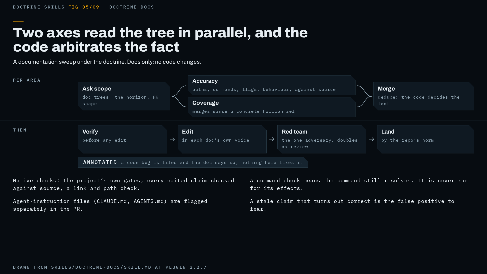

# doctrine-docs

A documentation sweep: the agent reads the codebase, finds every doc claim that no longer matches the code and every shipped behaviour no doc mentions, fixes the docs, and lands the result the way your repo normally ships work.



The figure shows the wrapper's phases, seats and gate.

## When to use it, and when not

Use it when you want the docs to match the implementation and you are not asking for the implementation to change. The trigger is a documentation sweep: reviewing the codebase so all docs reflect the current implementation, updating stale docs, covering undocumented features, then landing the sweep by the repo's delivery norm.

It is docs-only. No code changes and no bug fixing. When a doc-versus-code mismatch turns out to be a bug in the code, the run does not fix the code. It files the bug on the project's tracker and rewrites the doc to describe what the code does today, with an annotation of the form "currently does Y, see issue #N; intended X". Where no issue can be filed, because the project's CLAUDE.md names no tracker, `gh` is not authenticated, or you have not said where issues go, the annotation goes in without a number and the bug is listed in the sweep summary instead. The run never invents an issue number, never drops the annotation, and never stalls waiting for a tracker.

Two neighbours look similar and are not:

- `doctrine-write` is for when the writing itself is the deliverable: a proposal, a brief, a PRD, a report. Its own spec draws the line: doctrine-docs owns codebase-doc sweeps, doctrine-research owns producing researched content, and doctrine-write is chained after either when the prose is the product.
- `doctrine-research` is for a multi-source question that needs a fact-checked recommendation. Its spec sends codebase questions to `doctrine-audit` and names no boundary against this skill; the line above comes from doctrine-write.

For bug hunts, use `doctrine-audit`. For a single-file edit or a one-off question, no wrapper applies.

## What it asks you first

The run asks only the scope questions your request did not answer and the repository cannot. There are three:

1. Which doc trees count: README, `docs/`, CLAUDE.md, playbooks, or some subset.
2. The Coverage horizon, where history does not settle it. This is the point in history after which the run walks merges looking for undocumented behaviour. Where the repository gives a defensible ref (a tag, a release SHA) the run takes it without asking, and where it gives several it takes the widest, not the nearest. Where the candidates do not order (two branches neither of which contains the other) there is no widest, and the run gives each its own range. It becomes a question for you only where even the widest range would still be a guess about what you want covered.
3. How the sweep lands: whether you want a PR at all, and if so one PR or one per area for a big sweep. The default is one PR where the repo's norm is PRs.

Your answers, in your own words, become the anchor (doctrine step 1): written to disk verbatim and handed to every agent that later judges the work. The anchor also records the two figures the loop's alarms fire on, a round count and a time budget, at the hub's defaults of 4 rounds and two hours unless you state others.

One more thing can come back to you mid-run. When the two axes agree on what the code does and disagree on what the doc should say about it, and only you can settle which way the doc is aimed, that is a direction question and it blocks until you answer.

## How the work runs

The wrapper maps a sweep onto the hub's posture like this.

**Scope (doctrine step 1).** The three questions above, and the horizon settled as a concrete ref, or one per unordered candidate, before any Coverage agent is dispatched.

**Inventory and waves (doctrine step 2).** The run inventories the doc surface, splits it into areas, and for each area dispatches two axes as parallel sub-agents so neither pollutes the other's context. The Accuracy seat verifies every checkable claim in each doc (paths, commands, env vars, endpoints, flags, behaviour) against the current source and reports stale ones as `doc-file:line` with the evidence in code. The Coverage seat walks merges since the horizon and the module list, finds shipped features and behaviour changes no doc mentions, and reports each gap with the code evidence a writer needs. The two lists are merged and deduplicated per area before anything is edited. Where they disagree on a fact, the code decides. Where they disagree on what to do about a fact, the code decides nothing: it goes to the direction test, or the run rules it and writes the ruling and its reason into the record.

**Verify (wrapper step 3).** Every finding is checked against source before an edit. The false positive this shape fears most is a "stale" doc that was right, rewritten so the code becomes the loser of an argument nobody checked.

**Edit (wrapper step 4).** Accuracy findings are fixed and Coverage gaps written, each in the existing voice and structure of the doc it lands in. The editing pass uses `writing-clearly-and-concisely` if you have it installed, and otherwise Strunk's core rules stated inline: omit needless words, active voice, definite concrete language. Redundant docs are deleted rather than kept in step with each other. Edits to CLAUDE.md or AGENTS.md change agent behaviour, so they are flagged separately in the PR.

**Native checks (doctrine step 3).** Every check your project documents as a gate runs first, then this wrapper's three additions. See the next section.

**Red team and loop (doctrine steps 4 and 5).** One adversarial pass per round over the diff, briefed in full, then repair and loop until a pass comes back clean. The next section says what fills the slots.

**Simplify (doctrine step 6).** A simplification review runs before the pass expected to certify the shipping revision, so its diff is inside what that pass certifies.

**Deliver (doctrine step 7).** By the repository's norm, with the sweep summary. The report opens with the gate line.

## What the gate is for this shape

The hub says a wrapper supplies four things: the core discipline, the designated review, the red team's axes, and where the record lives.

**Core discipline: native checks for a docs diff.** Every check the project documents as a gate, wherever it documents one (CLAUDE.md, README, a review doc, the task runner), plus three additions: re-verifying every edited claim against source, a link and path check, and a command check. The project's gates come first and the three are added to them, never substituted for them. A repo carrying `vale`, `markdownlint`, `mkdocs build --strict` or a link-checker in its task runner runs all of them, and a project with no build step still has gates, so the run reads `package.json` scripts or their equivalent itself. "Command check" means each documented command still resolves: the binary exists, the script name is in the task runner, the flags match `--help`. It does not mean the command was executed. The run never runs a documented command for its effects (`npm run migrate`, `terraform apply`), because that would break the docs-only boundary. Where only running a command could verify a claim, the claim is marked unverified and the summary says so. That boundary is written into every Accuracy prompt and every red-team brief, because the seat told to verify commands is the one that would otherwise run them.

For a deliverable that does not execute, the hub treats this docs-only check as the real-environment run its gate requires. That is why a docs sweep can carry "real run on record" in its gate line.

**Designated review: the red team itself.** This wrapper names no separate review skill. The red-team pass is both review and red team, and it runs once per pass, not twice. That makes its brief the whole of the review, so the brief is specified in detail: the diff itself pasted in (never a filename), what the sweep was supposed to do, the Accuracy and Coverage findings already cleared so the seat attacks what was passed rather than restating what was caught, the command boundary, and the scope decisions from step 1 (which trees, which horizon, which PR shape), which a fresh context would otherwise reopen with full confidence.

**Red team axes.** Four, and the seat's coverage is exactly these: claims still wrong, errors the edit newly introduced, coverage the sweep missed, and each doc's own voice and structure. The return comes back sorted: blocking, then non-blocking, then what it attacked and could not break. A return with no attack list has reported nothing and no pass counts clean on it. Every finding is verified from source before anything is changed, since adversaries invent things too.

**The seat that fills the red-team slot.** By default the `codex:codex-rescue` subagent, a different model. Without the codex plugin, a fresh-context subagent prompted to refute the diff, with the verify-from-source rule in its brief; the report names the substitution, because a same-model adversary shares your blind spots.

**Exit.** This wrapper adopts the hub's prose-deliverable exit by name. A phase exits on one clean pass: no blocking finding, none outstanding from an earlier pass, and the docs-only check on record for the revision. A finding blocks when someone acting on the docs as they stand would do the wrong thing, and a false claim about what the product does, in a doc that ships, is the standing instance. Where no pass has come clean by the round alarm's first firing, the exit is one closing round scoped to the diff since the last fully reviewed revision, then Shipped at an escalation, with a punch list of what it did not fix. The hub's rule that documentation waits until after exit does not apply here, since the docs are the deliverable.

**Where the record lives.** The wrapper is silent, so the hub's default applies: beside the work in the target repo, excluded from version control and from every reviewer's diff and search, with its path named in the report.

## A worked example

This example is illustrative: it shows the shape of a run, not a recorded one.

You are in a Node project with a README, a `docs/` tree, and a CLAUDE.md. `package.json` has a `lint:docs` script that runs `markdownlint`. You type: `use doctrine-docs on this repo; the API docs are behind the code`.

The run asks the two scope questions the repository cannot answer. You answer: README and `docs/` count, CLAUDE.md does not; land it as one PR. It does not ask about the horizon, because the repo has release tags, and it takes the widest defensible one, `v2.3.0`, rather than the last commit that touched `docs/`. Your two answers and the request go into the record verbatim as the anchor, with the alarms at 4 rounds and two hours.

It inventories the doc surface into two areas, README and `docs/`, and dispatches an Accuracy seat and a Coverage seat for each, four seats in one wave. Each Accuracy prompt carries the command boundary. Each Coverage prompt carries `v2.3.0` as its concrete ref. The seats return: five Accuracy findings as `doc-file:line` with code evidence, two Coverage gaps with the commits that shipped them.

The run verifies all seven against source. One Accuracy finding is a false positive: the doc said a flag defaults to off, the seat read a test fixture that sets it on, and the source agrees with the doc. That one is dropped, and the drop is recorded. One of the remaining four is not a doc defect at all: the endpoint documented as returning a list returns an object, and the code comment says it should return a list. That is a code bug. The run files it, and rewrites the doc as "currently returns an object, see issue #212; intended a list".

It edits: three claims corrected, one annotated, two gaps written in the voice of the docs they join. It runs the gates: `npm run lint:docs` exits 0; every edited claim is re-read against source; every link and path in the diff resolves; every command in the diff resolves against `package.json` and `--help`, none executed.

Round 1. The red team is briefed with the diff pasted in, the anchor, the six cleared findings, the four axes, the command boundary and the three scope decisions. It returns one blocking finding on the newly-introduced-errors axis: a gap the sweep wrote names an environment variable the code reads under a different name. It also returns two non-blocking suggestions and an attack list of what it tried on the other three axes. The run verifies the blocking finding from source, repairs it, asks where else the same mark would be (nowhere: the variable appears once in the diff), and reruns the gates on the repaired revision.

Round 2. The red team is briefed again, on the repaired revision, with the repair's own diff beside the full one, and returns nothing blocking with a full attack list. The docs-only check is on record for that revision. The pass is clean.

The simplification review runs before that certifying pass, and lands nothing. The run opens one PR against the repo's norm. The report's first line is the gate line, in the form the README shows:

```text
Gate: clean pass on b71c2e0, real run on record. No blockers open.
```

Under it comes the sweep summary: docs touched (README, two files under `docs/`), stale claims fixed (three), gaps filled (two), bugs filed (one, #212), bugs not filed (none). Then the request walked item by item: "the API docs are behind the code" and where each piece of that landed. Then the deferred list, carrying the two non-blocking suggestions, and the record's path.

Had round 4 arrived without a clean pass, the round alarm would have stopped the loop with a diagnosis for you, and the exit would have been the closing round the prose-deliverable exit defines, with the gate line naming the punch list instead of a clean pass.

## How to invoke it

The description's trigger phrase is a documentation sweep: ask for the docs reviewed against the current implementation, stale ones updated, undocumented features covered, and the result landed.

A sample prompt:

```text
use doctrine-docs: sweep README and docs/ against the code since v2.3.0, one PR
```

Giving the trees, the horizon and the landing in the prompt answers all three scope questions up front, so the run asks nothing before it starts.

## Requirements

Nothing has to be installed. The wrapper names these external skills, each with a fallback:

- `writing-clearly-and-concisely`, for the editing pass. Without it, Strunk's core rules are applied inline: omit needless words, active voice, definite concrete language.
- The OpenAI codex plugin, for the red team. Without it, a fresh-context subagent prompted to refute, and the report says a same-model adversary filled the slot.
- superpowers, for parallel dispatch. Without it, parallel Agent tool calls, each prompt assembled in full, with check output pasted before any wave is called done.
- ponytail, for the simplification review. Without it, `/simplify` or a manual YAGNI pass.
- session-memory, for a handoff between sessions. Without it, the run writes the handoff itself per the hub.

The full install list with what each is for is in [`docs/requirements.md`](../requirements.md). Watching the seats work as they run needs herdr and is described in [watching-a-run](../watching-a-run.md).

## Red flags

Signs a run is not the one this page describes, in your terms:

- The report says the claims were re-verified but your repo's own `vale`, `markdownlint` or docs build never ran. Expect a clean pass followed by red CI.
- A documented command was executed to check it, and state a docs-only sweep promised not to touch has changed.
- An annotation carries an issue number nobody filed, or the annotation is gone because no number existed.
- Coverage seats went out before the horizon was a concrete ref. Three seats walked three histories and merged one list that looks complete.
- The red team got the diff and nothing else, returned taste, reopened scope you settled at step 1, and was still counted as the review.
- A PR was opened in a repo whose norm is a local commit or a patch.
- A "stale" claim was rewritten that was correct, and the code is now the loser of an argument nobody checked.
- CLAUDE.md or AGENTS.md changed inside the sweep with nothing flagging that agent behaviour changed.

The specification is [`skills/doctrine-docs/SKILL.md`](../../skills/doctrine-docs/SKILL.md); trust it over this page wherever the two disagree.
