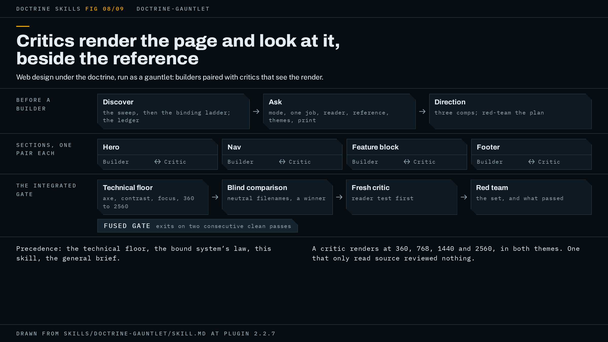

# doctrine-gauntlet

Web design run through the doctrine: agents build each section of a page, critics render the result and judge it beside a reference, and a browser-driven floor measures what a screenshot cannot show.



The figure shows the shape in three rows: what happens before a builder (discovery, the questions, the direction), then one builder and critic pair per section, then the integrated gate that runs once per round on the assembled page.

## When to use it, and when not

Use it for visual work that ships as a rendered page: building or restyling a page, a hero, a landing page, or a design-system card. It is for work where the deliverable is what a person sees in a browser, and where the question "would a human want to look at this" is a real risk of being answered no.

Do not use it for the logic behind the page. Application code and data wiring belong to `doctrine-code`. Do not use it for a one-off tweak either: the run asks questions before it starts, dispatches a pair per section, and runs a gate every round, and none of that scales down to a single CSS change.

It needs a browser. Without one, the harness prints the install line and refuses to run rather than report a pass, and the run stops and tells you, since a critic that cannot look is the failure this skill exists to prevent.

## What it asks you first

The run reads your repo first, silently: it looks for a design system, a reference, a way to render the deliverable, and whether it may write where the work must land. It never asks what reading the repo answers. Then it asks, one topic at a time.

**Which mode.** Asked every run, never assumed. The two modes differ in how they end.

- **Fused gate** is bounded and terminating. The phase exits on two consecutive clean passes of the integrated gate: floor, critic and red team, with nothing blocking. Four unresolved rounds stop the loop and put a diagnosis to you; if you say continue, the stop re-arms at 8, then 12.
- **Pure gauntlet** is long-running. The critic pool decides when the work is done: the phase exits when three consecutive rounds each end with a fresh critic picking the candidate over the reference with nothing blocking, or when two consecutive rounds accept no diff and leave nothing blocking. It overrides the four-round stop on purpose. Every sixth round it stops, summarizes what is still being rejected, and asks whether to continue. The run will tell you up front that this mode can run for hours and burn heavy tokens. In a run with no reference, or one graded on fidelity as the whole run's bar, only the unchanged-rounds exit can fire, so it ends sooner than its reputation suggests; fidelity granted for named material alone leaves the comparison, and its exit, live everywhere else.

In either mode the hub's time alarm still applies: your time budget, two hours by default, since the last round closed, or since the phase opened, stops the loop with the same diagnosis and waits for your ruling.

**The page's one job and its audience.** The named target reader goes into every critic's prompt, because the first thing a critic answers is whether the page serves that reader.

**The comparison target, and whether to exceed or match it.** "Make it look like that brand" often means match that quality, not beat that site. The answer rewrites the critic's bar: under fidelity, a faithful match is a pass, not timidity.

**Destination repo and delivery norm.** Where the work lands and how the repo ships.

**How many themes the project ships, whether the deliverable is a whole page or a fragment, and whether it will ever be printed.** These three are established here and never inferred from the page. A source tree with one palette is equally a site that ships one theme and a site whose second theme somebody deleted. The answers set `--single-theme` and `--fragment` on every harness invocation and grant the corresponding exemptions in every critic's prompt. Get the theme answer wrong in the single direction and a dead second palette exits the phase clean.

**Binding a design system.** Discovery sweeps the repo and the directories one level out, then walks a ladder: what your prompt names; a `Design system:` line in `CLAUDE.md`; a convention sniff for tokens, a law doc, a harness, a manifest or pinned renders; an existing Claude Design project, which is a rendering and never a binding; and, when nothing holds, no house system at all. That last rung is the ordinary case, not a degraded one. Once bound, the system's design law outranks the skill; its exit condition and loop do not. An unreplaced scaffold default is not house law, and the run tests each value for provenance before treating it as a ruling. The run confirms any binding it inferred, and says which candidates it rejected. Where it found a binding and your `CLAUDE.md` is absent or silent about it, it writes the `Design system:` line there as a step of the run; without write authority the line rides in the handed-over diff instead.

**The reference.** A runnable reference is rendered and put through the floor; a static one is looked at; a source file is built first; a brand name with no artifact is no reference, and the run creates the design direction from three rendered concept comps you pick from. In a restyle there are normally two candidates, the page that exists and the work it should rival, and the run asks which one the blind comparison judges against.

## How the work runs

A phase is a page, or one design-system card. A wave is the builder/critic pairs inside that phase, one pair per section. The run follows the hub's posture, mapped this way.

Before anything is built, the run writes a ledger: every fact the page may assert, each with its source, harvested from your prompt, the repo and, in a restyle, the predecessor itself. Every builder, comp agent, critic and adversary is handed it. A builder asserts nothing outside it; a missing value becomes a visibly labelled placeholder rather than a plausible guess. The ledger lives at `docs/design-ledger.md` in the deliverable repo, or in the bound system's own docs location, or in the scratchpad where neither is writable, and it also carries the list of questions you have already ruled on, so a fresh critic does not reopen them.

With no reference, the run fans out three concept comps, each a rendered candidate, and you pick one, reject all, or ask for a blend. The pick is written to `docs/design-dna.md` in the deliverable repo, or the bound system's own docs location, or the scratchpad where neither is writable. With or without a reference, the run then puts the concept to you, what each section is rather than how it will look, and gets it approved. Then, before a builder touches it, a direction adversary attacks the plan itself and answers eight questions with KILL, WEAKEN or CLEAR. It gets one revise-and-reapprove cycle; a second kill is your question.

Then the gauntlet (doctrine step 2's waves): one builder per section, each paired with a fresh-context critic. The critic renders the section at 360, 768, 1440 and 2560 in every theme the run claims, and rejects with specific art-direction notes. A section passes when its critic accepts it with nothing blocking. If a critic rejects the same section three times, the run stops and puts the disagreement to you. Builders that share a file are serialized, and every builder gets its own worktree, output directory and port, because a second build under a running server keeps every URL answering while serving another branch's page.

When every section has passed, the run integrates the page and runs the gate once per round (doctrine steps 3, 4 and 5): native checks, meaning the technical floor plus every gate your project documents, whether or not it compiles; the blind comparison, where the run has a reference; a fresh critic on the integrated page; and the red team. The blind comparison presents matched pairs of candidate and reference at the same width and theme under neutral filenames in random order, and the critic names a winner before being told which is which. The integrated critic answers the reader test first and lets that answer block: a page that passes every gate and bores its reader has failed. The red team attacks what the round passed, judges the set rather than the sections, checks print, which nothing else in the run checks, and checks what the page asserts against the ledger, pixels included.

At the first round that finds nothing blocking, the run simplifies (doctrine step 6): decoration that survived the rounds, one-off styles that should be tokens, dead variants. That diff enters the gate and resets the counters, so the passes that close the phase certify what remains.

Polish goes to a docket, the project's existing polish backlog in the deliverable or the system repo, or `docs/design-docket.md` where neither has one, rather than forcing another round, because taking a polish fix is an accepted diff and restarts the clean-pass count. Docket items are marked PROPOSED or RULED, and a builder may not cite a PROPOSED item as a constraint. Taste calls that are bold but arguable go to you, capped at three decision escalations per phase, batched rather than asked one at a time.

Delivery (doctrine step 7) commits to the deliverable repo by its norms. After the gate line, the run walks your brief item by item, naming the diff that carried each one or its explicit deferral, and verifies against the live page rather than its own summary. If it cannot write where the work must land, it builds in a scratch directory and hands you the diff, the renders and the docket together.

Where your host has the Workflow tool, one fused-gate round can run as a journaled, crash-resumable script, `harness/round.workflow.mjs`. The script holds structure and counters only and no brief text; the prompts are assembled the same way. Without the tool, the prose flow is the round, unchanged.

## What the gate is for this shape

The hub exits a phase on one clean pass. This wrapper replaces that with its own exit, stated with its own counters, and the hub sanctions the replacement by name.

In fused mode, a round blocks on any of: a floor failure or a failing native check the work caused (an inherited failure the brief names is recorded, not blocking); a violation of the bound system's law, except a clause the run has marked stale, though a house gate that mechanically enforces that clause still blocks until you waive it by name; a measured geometry or contrast error; a false claim printed on the page; losing the blind comparison; failing the reader test; an `[UNMEASURED]` line in the floor report; an axis the critic could not assess, which arrives as `CANNOT JUDGE` on its roll call; a roll-call line missing or contradicting the findings under it, which no ruling can waive; a red team item marked `NOT RUN` or missing; and the critic's verdict that the work is timid, off-grammar or generic. That last one is the point of the skill: without it, "this is mediocre" files as polish and a page nobody rates exits clean.

The counters, in one place:

| Counter | Mode | Fires at |
|---|---|---|
| consecutive clean passes | fused | 2, the phase exits |
| unresolved rounds | fused | every multiple of 4, escalate |
| critic win streak | pure | 3, the phase exits |
| unchanged rounds | pure | 2, the phase exits |
| section rejections | both | 3, put it to you |
| rounds since check-in | pure | 6, stop and ask |

The technical floor runs on the integrated page every round in both modes: zero axe serious or critical violations in both themes; text contrast measured, not assumed; non-text contrast on charts, icons and focus indicators; a visible focus indicator on every interactive element; reduced motion that is static; exactly one `h1` and no skipped heading levels; no layout break at 360, 768, 1440 or 2560; target size measured as the region that accepts a pointer, 24x24 CSS pixels, on every control the probe can reach; and, where the work claims two themes, a second theme a real user can reach. 2560 is in the ladder because a whole class of defect lives above 1440: type authored at fixed pixel sizes stays byte-identical while the sheet grows, and seven rounds at the three narrower widths once passed a page whose nav links were 13px at every resolution. Print is a floor surface too, and the red team is the one that checks it. Performance is measured only where the project has the tooling, and otherwise reported as unmeasured, never as a pass.

The harness ships beside the skill. Its invocation, run from the target project so it resolves that project's Playwright and axe:

```text
node <skill-dir>/harness/floor.mjs <url-or-file> <outPrefix> [dark|light|both]
    [--fragment] [--single-theme] [--theme-class=NAME] [--crop=SELECTOR] [--expect=TEXT]
```

The flags and what each decides:

- `--single-theme`, with the one theme named: the project ships one theme. Without it the missing theme is an `[UNMEASURED]` that never clears, and the gate cannot close.
- `--fragment`: a host page owns theme switching and the type scale, as for a design-system card. A missing `h1` is not a defect and the reachability and frozen-type judgements are suppressed. It suppresses no `[UNMEASURED]` line, so a single-theme fragment needs both flags.
- `--theme-class=NAME`: toggles a class on `<html>` and `<body>` for projects that theme that way, such as Tailwind's `dark`. Without it those projects report a false "theme switch had no effect".
- `--crop=SELECTOR`: also shoots that element at 1:1 per width and theme, which is the only way anyone sees a figure at shipped size.
- `--expect=TEXT`: refuse to measure unless that text appears in the rendered page. Use it on any `http://` target, because a URL answering 200 is not evidence it served what you meant.

Exit codes: 0 clean; 1 failing configurations; 2 could not run; 3 nothing failed but something went unmeasured, which is not a pass. The verdict line has three forms and none reads as a pass by accident: `=== TECHNICAL FLOOR: PASS ===`, a NOT CLEAN form naming how many items went unmeasured, and `=== TECHNICAL FLOOR: N failing configuration(s) ===`. Each configuration writes a full-page PNG at `<outPrefix>-<theme>-<width>.png`, eight files on a two-theme run and four under `--single-theme`, and those files are what every critic grades.

Two markers in the report carry gate law. `[UNMEASURED]` is a gap in this run: axe could not be resolved or timed out, a contrast axe could not determine, a theme switch that had no effect, a stylesheet, font or image that never arrived, a page still changing after it was measured, and others the sidecar lists. It is not clean; it blocks and advances the counter until you waive it. `[JUDGE]` is a question the harness hands to eyes: non-text contrast, visible focus and canvas-driven motion on every run, and, under their own conditions, theme reachability, content clipped inside a scrollable component, an undersized target the spec exempts, type frozen above 1440, and others. A `[JUDGE]` line never gates by itself; the critic's answer to it does, so a critic finding a second theme unreachable is a floor failure and blocks. Theme reachability is a `[JUDGE]` item on purpose: the harness applies the theme itself, so both palettes render whether or not a user can reach the second one, and a dead palette must not be waivable.

## A worked example

This example is illustrative: it shows the shape of a run, not a recorded one.

You ask: "restyle the marketing landing page with the gauntlet; the old page is the reference, and it should beat it." Discovery finds no `Design system:` line, no tokens file and no sibling kit, so the ladder ends at nothing bound and the brief in the skill is the law. It finds a Next project with a `build` script and a `lint` script, both documented in the README as gates, and a `test` script that is watch mode, so the run substitutes its non-interactive form, `vitest run`, and records the substitution. It drafts the ledger in scratch space from your prompt and from the existing page: the company name, the four plan tiers and their prices, the two certifications named in the footer, the support address.

It asks. Mode: you say fused gate. One job: convert a visiting engineer to a trial sign-up; that engineer is the named reader. Comparison: the existing page, to be exceeded. Destination: this repo, PR norm. Themes: two, with a toggle in the header. Whole page. Never printed. Each answer lands in the ledger, and the ledger moves to `docs/design-ledger.md`.

It renders the existing page and runs the floor on it, recording that the predecessor fails text contrast on its footer links, so no critic will demand parity on that. It writes the direction to `docs/design-dna.md`: one bold moment in the hero, a restrained palette with a hue bias, a display face and a body face, motion spent once. The run puts the concept to you, four sections and what each is for, and you approve it. The direction adversary returns eight lines: seven CLEAR, one WEAKEN on the wall of copy under the hero at 360. The direction is amended in place and re-checked.

Four pairs go out, each in its own worktree: hero, features, pricing, footer. Three sections pass first time. The pricing critic rejects once, because the tier cards clip their last row at 1440 inside a scroll container, and passes the rebuild. Section rejections for pricing: 1.

Round 1. The floor runs on the integrated page:

```text
node ../doctrine-skills/skills/doctrine-gauntlet/harness/floor.mjs http://127.0.0.1:3000/ out/r1 both --theme-class=dark --expect="Start your trial"
```

It exits 3: nothing failed, but the display font never arrived, and the report carries an `[UNMEASURED]` line naming the resource. `build`, `lint` and `test` are green. The blind comparison, four pairs at 1440 and 360 in each theme, picks the candidate. The integrated critic's roll call has every axis `CLEAR` except one `BLOCKING` on the wall: at 360 the first image sits below six paragraphs. The red team's roll call reads `HELD`, `HELD`, `HELD` with the never-printed reason on item 3, and `BROKE` on item 4: the pricing section says "trusted by 400 teams" and the ledger has no such figure. Round report: consecutive clean passes 0, unresolved rounds 1, section rejections pricing 1, escalations spent 0, docket 2 polish items open. The block is written to the ledger's run-state section.

Repairs: the font is served from the project, the image moves above the copy in source order, the invented figure comes out and the builder asks for the real one, which you supply and the ledger takes.

Round 2. The floor exits 0. The comparison picks the candidate. The critic and red team come back with nothing blocking, two polish notes to the docket. Consecutive clean passes 1. Because this is the first clean round, the simplification pass runs now: a decorative gradient nobody asked for goes, two one-off spacing values collapse into tokens. That diff resets the count to 0.

Round 3 gates the simplified page: clean. Consecutive clean passes 1. Round 4: clean again. Consecutive clean passes 2, and the phase exits.

The report opens with the gate line, in the form the README shows:

```text
Gate: clean pass on 3f9c1d2, real run on record. No blockers open.
```

Under it: the revision certified is the one shipping; the second consecutive clean pass was round 4; `build`, `lint` and `test` ran green on that revision; the floor exited 0 in both themes; the comparison winner was the candidate in every round; and the red team's attack list from round 4. Then your request, item by item: restyle, carried by the four section diffs; the old page as reference, compared blind in rounds 1 through 4; beat it, the comparison verdict each round. Then the docket path with its four polish items, all PROPOSED, and the PR the repo's norm asked for, with the renders attached.

Had round 4 found a new blocking finding instead, the count would have reset and the loop continued; had the fourth unresolved round arrived, the run would have stopped with a diagnosis, and the gate line would have taken the README's other form, naming the round and what was still open.

## How to invoke it

The skill fires on a request for web design or front-end visual work done with the doctrine or "the gauntlet": building or restyling pages, heroes, landing pages, and design-system cards. A sample prompt:

```text
use doctrine-gauntlet to restyle src/app/page.tsx; the current page is the reference and the new one should beat it
```

The floor needs a browser in the target project. From that project:

```text
npm i -D playwright-core axe-core
node node_modules/playwright-core/cli.js install chromium
```

Not `npx playwright install`: that command belongs to the full `playwright` package and refuses when only `playwright-core` is present. Where Playwright and axe are installed globally rather than in the project, prefix the harness with `NODE_PATH=$(npm root -g)`.

## Requirements

- **A browser, via `playwright-core`, and `axe-core`.** Hard requirement. Without a browser the harness refuses to run. Without axe, accessibility is reported as unmeasured, never as passed, and the `[UNMEASURED]` line blocks until you waive it.
- **The `doctrine` hub.** Installed with this plugin; the wrapper loads it first.
- **OpenAI's codex plugin.** The default red team, and the image generator for concept comps and assets. Without it, the red team is a fresh-context subagent that must be able to see the screenshots, and the run says the adversary is same-model; art is built natively in CSS, SVG or canvas, or you are asked for assets, and the run says which happened. If no adversary at all can see images, the red team runs over the diff and the critic's reports and the gate is reported as weaker than it claims.
- **Claude Code's Workflow tool.** Lets one fused-gate round run as a journaled, resumable script. Without it the prose flow is the round.
- **Claude Design.** Optional sync so you can watch finished sections in the Design pane. Git is the source of record either way; without it the run says the sync was skipped.
- **superpowers.** Parallel dispatch and worktree isolation. Without it, parallel Agent calls and `git worktree add`.
- **ponytail.** The simplification pass. Without it, `/simplify` or a manual YAGNI pass.
- **herdr.** Optional. Inside a herdr session the Codex red team runs as a visible seat; outside one it runs as `codex exec`.

## Red flags

These are the failures that arrive with no alarm attached. Watch for them in the report.

- A critic that passed a section it only read the source of. If it did not render, it reviewed nothing.
- A critic prompt assembled ad hoc rather than from the critic brief. Whatever was left out came back perfect.
- Every gate green and nobody asked whether a human wants to look at the page.
- A content rule enforced on text nodes while the banned thing sits inside a photograph or a canvas.
- An item of your brief that no diff claims, noticed only after the phase closed.
- A floor item reported as passing when the harness never measured it.
- A dev-server overlay, a hydration warning, or a wholly unstyled page graded as a design defect rather than a broken harness.
- A measurement dispute settled with a better number instead of a crop.
- An instrument found broken with the rounds it already passed left standing; a broken instrument voids those rounds.
- Two builders in one repo sharing a build directory or a dev server.
- `pkill -f` or `pgrep -f` with a pattern that matches the run's own command line.

How the harness itself is tested, and what those tests cannot reach, is in [how this is tested](../how-this-is-tested.md) and [the generality fixtures](../../fixtures/README.md). The hub's page is [doctrine](doctrine.md), and the project overview is the [README](../../README.md).

The specification is [`skills/doctrine-gauntlet/SKILL.md`](../../skills/doctrine-gauntlet/SKILL.md); trust it over this page wherever the two disagree.
