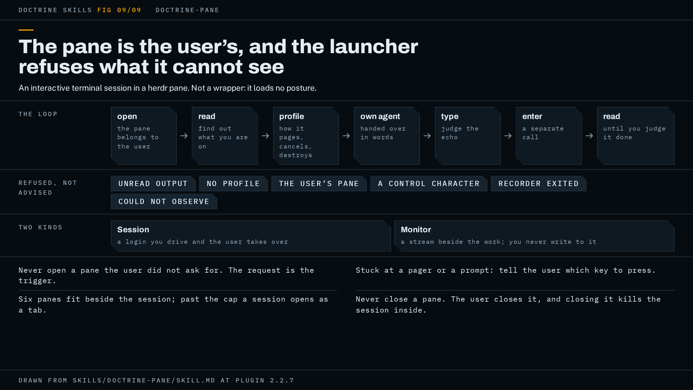

# doctrine-pane

An interactive terminal session in a herdr pane, so you see what the agent sees on a device and can take the keyboard whenever you want it. It is not a wrapper: it does not load the doctrine posture, and it is usually invoked in the middle of some other task.



## When to use it, and when not

Use it when you want to watch a login as it happens: an SSH session to a box, a router or switch console, a log you want tailed beside the work. The split is yours and the skill does not re-decide it. A request to see the connects gets panes, and the number of devices does not change that: ten devices you asked to watch is ten sessions. Work you did not ask to watch stays where the project already runs it, an MCP server or a script, because parsed output is what makes many results comparable. The skill opens no pane on its own judgement. "Pop a pane" is a request, and everything else is not.

There are two kinds of pane, and only one has state. A Session is a login the agent may drive and you may take over. A Monitor is a stream beside the work, `docker logs -f` or a firewall tail, that the agent never writes to and that you interrupt by typing in it. A Session on a device means the agent stops making automated calls to that device until the pane closes, so two writers never interleave into one transcript. That does not make the device free: a cached connection or an operation in flight can still hold it, and the connect then fails in the pane where you can see it. A Monitor stops nothing, since the case it exists for is watching a deploy while the agent runs it.

A pane needs a real PTY. The launcher runs your connect command under `script(1)`, which records everything that crosses the terminal into a transcript file the agent reads. herdr provides the pane itself: the split beside your session, the sidebar tab when the column is full, and the calls that send text and keys into it. Without herdr there is no pane, and the skill refuses rather than running the session some other way. In a doctrine run that refusal is recorded as a step that did not run, never as one that passed, and the run continues by its non-interactive path under doctrine step 3.

## What it asks you first

Nothing, as a skill. There is no question round, because you are usually mid-task and loading a posture to run two commands would be wrong. What it needs is in your prompt: which device or host, and that you want a pane. The connect command is not the agent's to invent. This plugin carries no device-vendor knowledge, so the agent takes the connect command from the project you are in, its docs, its tooling, its inventory, and lets it read its own credentials from its own paths. The agent handles a path, never a secret. If your project has no written-down way to reach the device, say the command in the prompt.

## How it runs

The launcher is `node <plugin-root>/hooks/dctr-pane.mjs`, two directories above the skill's own directory. It has six subcommands:

```text
open    <label> [<tee-file>] <connect-command>
read    <tee-file>
profile <tee-file> <what the platform is and how it behaves>
type    <tee-file> <text>
enter   <tee-file>
own     <tee-file> agent|user
```

`open` splits a pane beside your session, writes a marker for it, and runs the connect command in it under the recorder. The pane is yours from the moment it exists: the connect banner, an unknown-host-key question and any password prompt all land in that window, and none of them are the agent's to answer. If a password is wanted, you type it. Input logging is never enabled, so what you type at a password prompt does not reach the transcript. The transcript and the session record are created readable only by you.

The tee file is the transcript. Omit it and the launcher picks a file named for the label under `dctr-pane-logs` in your temporary directory, and prints the path as `tee=<path>`. Nothing removes that file when the session ends, and a label is sanitized down to letters, digits, dash and underscore, so two labels can land on one file and a repeated label reuses an earlier session's name. Give an explicit path whenever the transcript matters.

Six panes fit beside the session. That cap counts the run's dispatched seats and gate panes alongside interactive ones, and every placement happens under the same lock. Past the cap a session opens as a tab, listed in herdr's sidebar, watched and taken over the same way. The launcher prints `overflow=tab` when it does that, so the agent can tell you which it was. It cannot close anything for you.

The marker lives in a directory the session's cleanup does not sweep. That is why a pane survives the agent's session ending: a log you are watching does not die when the agent stops, and neither does its transcript.

The launcher enforces; the agent interprets. No code in it parses the terminal. An earlier version decided in code what a prompt was and whether a command had finished, and it was wrong on real hardware within two commands: a shell prompt is an arbitrary string, a pager prompt looks like a device prompt, and output going quiet does not mean a command ended. The agent reads bytes and judges. What the launcher refuses, none of it advisory: typing while the session has unread output, typing before the session has a profile, typing when the pane is yours, any control character in the text (a bare carriage return is Enter), writing after the recorder has exited (the connection closed and the pane is now a shell on the agent's own machine), and writing when it could not observe something, since a failed lookup is "I could not look", never "safe". These are checks before sending: output can still arrive, or the recorder can exit, between the final check and the keystroke, and the launcher cannot guarantee the terminal's state at that instant. A refusal prints `dctr-pane: <reason>` and exits non-zero.

The loop the agent follows is: `open`, `read` to see what it is on, then stop and profile the platform before typing anything. `profile` records what the platform is, how it pages, how to cancel on it and what is destructive on it, and `type` and `enter` refuse until it exists. The launcher cannot judge whether that research was good, so it enforces a floor instead: a profile shorter than 80 characters is refused. Then you hand the pane over in words and the agent runs `own <tee> agent`. `own` does not clear unread output, so the agent's first move after a handover is to read what you did. Your typing is recorded only where the terminal echoed it, and keys that produce no echo, a space at a pager, Ctrl-C, an arrow, leave no trace. When the agent does not know what you pressed, it says so rather than reconstructing a plausible sequence.

`type` sends text and stops. `enter` is a separate call, always, so the echo is judged first. Then `read` until the agent judges the command finished. The agent cannot send control keys at all, by design: a launcher that could send Ctrl-C, Ctrl-D, Escape at a confirmation or a single key at a pager could answer a prompt you never saw. When it is stuck it tells you which key to press. A configuration block that must arrive as one paste is the same case: `type` refuses newlines, so the agent puts the exact text in front of you and you paste it. The transcript records it either way.

When you take the pane back, the agent abandons the rest of its sequence rather than resuming, because you may have changed the device under it.

The session ends when you close the pane. The agent never closes one. Closing the pane kills the session inside it. The transcript stays on disk, at the default path or the one you gave, until you remove it, and so does the session record beside it, `<transcript>.state.json`, which holds ownership, the read cursor and the profile; remove that too when you are done. One thing does end a transcript: opening again on the same path truncates it, once the launcher has established that no live pane is using it.

## What is checked

This skill has no gate loop. What is checked is the launcher. `node hooks/dctr-pane.selftest.mjs` is its tamper test: every refusal trips and calls herdr zero times, proved by a tripwire `herdr` on PATH that counts invocations; a valid session is not refused; the broken fixtures are proved defective without calling the checker; and both `script(1)` invocations are asserted, so the macOS argument shape is checked without a Mac. `node hooks/dctr-mutations.mjs` reverts each named repair in a copy of the tree and fails if no check notices; several of its mutations target this launcher. CI runs both on every push, as part of the thirteen checks [docs/how-this-is-tested.md](../how-this-is-tested.md) lists. A doctrine phase that uses the pane still runs its own gate: the pane is where a command is driven, not a substitute for the checks the phase owes.

## A worked example

This example is illustrative: it shows the shape of a run, not a recorded one.

You are mid-way through a debugging task and say: "pop a pane and ssh into the edge switch, I want to watch." The agent finds the connect command in the project's inventory and opens the pane with an explicit transcript path, because the label `edge` has been used before.

```text
$ node hooks/dctr-pane.mjs open edge /tmp/edge-2026-09-10.log "ssh netops@edge1"
pane=ws1:12
owner=user tee=/tmp/edge-2026-09-10.log
--- session so far (judge it yourself; nothing here was parsed) ---
The authenticity of host 'edge1' can't be established.
Are you sure you want to continue connecting (yes/no/[fingerprint])?
```

A pane has appeared beside your session, unfocused. The host-key question is yours. You click into the pane, type `yes`, then the password, and the banner arrives. The agent runs `read`.

```text
$ node hooks/dctr-pane.mjs read /tmp/edge-2026-09-10.log
JUNOS 21.4R3-S7.8 built 2023-08-18 07:42:19 UTC
netops@edge1>
--- read 214 new bytes; owner=user; cursor=402
```

The agent now knows what it is on. Before typing anything it researches how that platform pages, how to cancel, and what is destructive, and records the result.

```text
$ node hooks/dctr-pane.mjs profile /tmp/edge-2026-09-10.log "Juniper Junos 21.4 CLI. Pages with ---(more)---, space advances and q quits. Ctrl-C cancels a running command. commit and request system reboot are destructive."
profile recorded for ws1:12:
Juniper Junos 21.4 CLI. Pages with ---(more)---, space advances and q quits. Ctrl-C cancels a running command. commit and request system reboot are destructive.
```

You say "go ahead, it's yours." The agent runs `own /tmp/edge-2026-09-10.log agent` and gets `owner=agent`. Handover does not clear unread output, so it runs `read` first and judges what you did. Then it types a command and judges the echo before pressing Enter.

```text
$ node hooks/dctr-pane.mjs type /tmp/edge-2026-09-10.log "show interfaces terse | no-more"
show interfaces terse | no-more
--- typed "show interfaces terse | no-more"; ENTER NOT SENT. Judge the echo above, then `enter`.
$ node hooks/dctr-pane.mjs enter /tmp/edge-2026-09-10.log
--- enter sent. Output may still be arriving; `read` again until you judge it finished.
```

The output lands in the pane where you can read it as it arrives, and in the transcript, which the agent reads until it judges the prompt has returned. Say you notice something and type a command yourself. The agent's next `type` is refused: `` dctr-pane: 96 bytes of unread output; run `read` and judge it before typing ``. It reads, sees your command and its output, and reports what it saw; if you pressed a key that left no echo, it says it cannot see that. If the agent hits a pager it must not dismiss, it asks you to press a key rather than working around it. When the session is done, you close the pane. The agent reports the transcript path and leaves the file where it is.

## How to invoke it

The trigger is any request to pop a pane, ssh into a box, log into a router or switch, get onto a console, or tail or monitor a log while the agent works. A sample prompt:

```text
pop a pane and ssh into radprox01, I want to watch while you check the disk
```

## Requirements

herdr 0.8.2 or later, with Claude Code running inside it. The launcher reads `HERDR_ENV` (must be `1`), `HERDR_WORKSPACE_ID` and `HERDR_PANE_ID` to find the session's pane, and `CLAUDE_CODE_SESSION_ID` to count the pane against the same cap and lock the seat and gate hooks use. Without any of them it refuses. It also refuses when `DCTR_VIEW_REQUEST_DIR` is set, which marks a contained session, because a pane is a host process. `TMPDIR` decides where a default transcript goes. Outside herdr the skill does not degrade into a weaker version of itself: there is no pane, the agent says so, and any command it needs runs non-interactively with the interactive step recorded as not run. [docs/requirements.md](../requirements.md) and [docs/watching-a-run.md](../watching-a-run.md) cover the herdr setup.

## Red flags

Signs the skill is being misused, in your terms:

- A pane opened because the work looked interactive, when you did not ask for one.
- The agent typing before it has profiled the platform, on the grounds that it already knows it.
- The agent reading bytes you typed mid-command, judging them harmless, and typing over them.
- A report of what you pressed, reconstructed from backspaces and bells, instead of the agent saying it cannot see it.
- `enter` sent without the agent having read the echo `type` returned.
- A vendor's pager idiom, prompt pattern or destructive-command list written into this plugin.
- A refusal worked around, instead of the agent telling you which key to press.
- A run that wanted a pane, could not have one, and reported the step as passed.

The specification is [`skills/doctrine-pane/SKILL.md`](../../skills/doctrine-pane/SKILL.md); trust it over this page wherever the two disagree.
