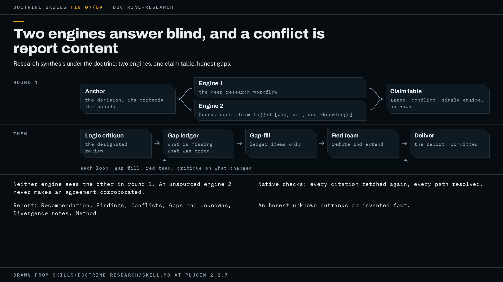

# doctrine-research

Research under the doctrine: two engines answer the same question without seeing each other, their claims merge into one table, and the report recommends only what that table carries.



The figure shows the shape of a run in two rows: round 1 runs the anchor into two engines and out to the claim table; the second row is the logic critique, the gap ledger, the gap-fill fan-out, the red team and delivery, with the loop bracket under gap ledger through red team, labelled with what each loop runs. Its footnotes are the independence rule, native checks, the report's sections and the honest-unknown rule.

## When to use it, and when not

Use it when you have a multi-source research question that needs a grounded, fact-checked recommendation: something where the answer is spread across web pages, docs and vendor claims, where a wrong answer is expensive, and where you want to see which claims two independent sources agree on and which they do not.

Do not use it for a quick fact lookup. A plain search answers that faster and the gate would cost more than the answer is worth. Do not use it for questions about your own codebase: that is `doctrine-audit`, which reads code rather than sources.

The boundary against the two other prose wrappers is what the deliverable is. `doctrine-write` produces a document you already know the content of, a proposal, a brief, a PRD, a report, and its gate is about the prose being clear, accurate and airtight. `doctrine-docs` sweeps existing documentation against the current implementation. `doctrine-research` produces an answer you do not yet have, and its gate is about whether every claim behind that answer traces to a source someone actually fetched.

## What it asks you first

Before any engine is dispatched, the run asks you whichever of three things your request left open and writes the answers, and what you already supplied, down verbatim as the anchor:

- The decision this research informs.
- Its success criteria.
- Its scope bounds: timeframe, region, budget, constraints.

Scope is part of the anchor, not a note beside it. Research that answers the right question about the wrong region has drifted, and a critique that holds the anchor without the bounds cannot see that.

It then asks where the report should land. The suggested form is a `docs/` subfolder of the current project, such as `docs/research/YYYY-MM-DD-<topic>.md`. That destination is agreed once, at kickoff, so delivery needs no second ask.

A question only you can answer, and where the work would be aimed differently depending on the answer, blocks the run until you answer it (doctrine step 1). A value missing inside a direction you have settled does not block: the report carries a visible unknown in that spot, never a guess.

## How the work runs

The wrapper maps its shape onto the hub like this. A phase is one research question, and the hub's loop (doctrine step 5) runs inside it. The dossier, one file opened before the first engine goes out, is the hub's record (doctrine step 1): it holds the anchor, the claim table as it currently stands, and the gap ledger.

Round 1 is dual-engine. Two engines get the same refined question, concurrently, and neither sees the other's output. Engine 1 is Claude, through the stock `deep-research` workflow. Engine 2 is the codex plugin's `codex:codex-rescue` agent, run as a read-only research task, with every claim it returns tagged `[web]` with a fetchable URL or `[model-knowledge]`. Independence is what makes the cross-examination mean anything: a second engine that critiques your draft is anchored to your frame and finds only your kind of gaps.

The run checks whether engine 2 can actually search before counting it as a second sourced engine. That agent's only tool is Bash and it shells out to the Codex CLI, whose web search is opt-in per user config, so on a default install engine 2 answers from model knowledge. The run reads the `web_search` setting in `~/.codex/config.toml` before dispatch and checks again on return: a `[web]` tag with no URL you can fetch is model knowledge whatever it says. The dispatch also says to run in the foreground, because that agent prefers background execution for open-ended work and cannot fetch its own results, so a deep question otherwise comes back as a job handle.

The merge (the wrapper's step 3) puts every claim into one table under one of four labels: agree, where both engines assert it; conflict, where they disagree and both sides are kept with their sources, since conflicts are report content and are never resolved silently; single-engine, unverified until a second source or a check confirms it; and unknown. An unsourced engine 2 does not turn an agreement into corroboration. A claim both engines assert when one of them answered from memory is one search result plus one recollection, and the table files it as single-engine, model-corroborated, with the report saying plainly that the run had one sourced engine. What an unsourced engine 2 is still good for is divergence: where it contradicts engine 1 it has found you something to go and check.

Then the loop. Every unknown and every unverified claim gets a gap ledger entry recording what is missing and what was already tried. Each loop is a targeted gap-fill fan-out over ledger items only, never a full re-run, then a red-team round, then the logic critique re-run on whatever changed. Parallel seats go out the way the hub says (doctrine step 2), and the loop ends the way the hub's prose-deliverable exit says (doctrine step 5). Delivery (doctrine step 7) writes the report to the agreed path and commits it by your project's norm.

## What the gate is for this shape

The hub's gate has three parts and the wrapper fills each slot.

Native checks (doctrine step 3) take the docs-diff form, since there is no code to run: re-verify every edited claim against the source it cites, then run a link and path check, every URL fetched and still carrying the cited content, every repo path or filename in the report resolved on disk. A citation that 404s, redirects to a homepage, or no longer says what you quoted is a blocking finding, and nothing else in the flow looks for one: the red team argues about claims and the logic critique argues about reasoning, and neither opens a link. On top of that come whatever checks your project documents as a gate for the directory the report lands in, a markdown linter, a docs build, a link checker, read from your task runner rather than assumed absent. Where the destination has none, the docs-diff form is the whole of native checks.

The designated review is the logic critique: a dedicated agent that reads the merged research for unsupported leaps, circular sourcing (many citations tracing to one origin), survivorship and recency bias, conflated adjacent questions, and drift from the anchor. It is handed the anchor verbatim, because its whole drift axis is drift from the anchor, and a critique handed the findings alone grades them against themselves. It is also told that a divergence flag is a return format: if the data suggests the real question differs from the one you asked, it returns that as a named finding, and the run puts it to you on receipt. Re-aim or stay is your call. Your ruling goes into the dossier's settled section, so the next loop's fresh critique does not re-open it.

The red team (doctrine step 4) attacks the merged claim table and the drafted report together, never a single source or a lone finding, because a table without the report's conclusion cannot catch a conclusion the table does not carry. Its axes are the wrapper's blocking instances: a dead, redirected or misread citation; a chain of citations that widens to four sources and narrows to one origin while the report calls it corroborated; a conclusion the claim table does not carry; drift off the anchor; a gap neither closed nor written up; a failed native check. It both refutes and extends the table, and anything it adds is verified from its cited source before it counts. One more confirming source on a claim already sourced is non-blocking and goes on the deferred list; a cleaner phrasing is not a finding.

The record lives beside the report, the agreed destination with a `-worknotes` suffix (`docs/research/YYYY-MM-DD-<topic>-worknotes.md`), or in the scratchpad where that directory is not writable or you do not want working files in the repo. Either way the Method appendix names its path, and at delivery the run asks whether it ships beside the report or is dropped. Its counters and round history sit under a trailing run-state heading marked orchestrator-only, which no reviewer is handed: a red team told how badly the pass needs to be clean holds the one fact it must not.

The exit is the hub's prose-deliverable exit, adopted by name, with one research-shaped precondition on its closing round: every remaining gap closed or written up as unanswerable with the attempts shown. A pass is clean when it produces no blocking finding and leaves none outstanding from an earlier pass. "No new findings" is not the test: an unsupported leap filed in loop 3 and filed again in loop 4 is outstanding, not new. When the round alarm first fires without a clean pass, the gap ledger as it stands goes to you inside the hub's diagnosis, and unless you say stop the run takes one closing round scoped to the diff since the last fully reviewed revision, subject to the gap precondition above, then ends the phase as Exited with a punch list of what it did not fix, named in the delivery line. The time alarm is separate and does wait: by default it fires two hours after the last round closed, or after the phase opened where none has, puts the same diagnosis to you, and the run continues only on your ruling.

When a dependency is missing: without the `deep-research` workflow, engine 1 is a fan-out of parallel web-search agents with per-claim adversarial verification. Without the codex plugin, engine 2 is a fresh-context subagent with web access, and the report notes that engine diversity was reduced. If engine 2 returns a job handle and has not returned by the time you would merge, it is treated as unavailable and the report says so. The logic critique is a fresh agent and needs nothing installed.

## A worked example

This example is illustrative: it shows the shape of a run, not a recorded one.

You ask for research on which of three managed message queues to adopt for an internal event bus. The run asks first. The decision: which queue the platform team commits to for the next contract term. Success criteria: at-least-once delivery, a documented retention ceiling that meets the audit requirement, and a hosted option in the region you operate in. Scope: that region only, current vendor documentation only, no pricing beyond list. It writes those words into `docs/research/2026-09-10-event-bus-worknotes.md` as the anchor, agrees the report lands at `docs/research/2026-09-10-event-bus.md`, and checks that the repo documents a markdown lint as a gate for `docs/`.

It reads `~/.codex/config.toml`, finds `web_search` enabled, and dispatches both engines in the foreground with the same refined question. Engine 1 returns findings with URLs. Engine 2 returns a tagged list, and on return every `[web]` tag carries a URL the run can fetch, so it counts as a second sourced engine.

The merge fills the claim table. Both engines cite the same retention ceiling for vendor A from its docs page: agree. Engine 1 says vendor B's regional endpoint is generally available and engine 2 says it is in preview, each with a different page: conflict, both sides kept. Only engine 1 found vendor C's delivery guarantee: single-engine. Nobody found vendor C's retention ceiling: unknown, and a gap ledger entry with the searches already tried.

Loop 1's gap-fill fan-out chases the ledger entries with the anchor pasted in. It finds vendor C's ceiling on a page linked from its changelog. The red team, handed the table and the drafted report, files one blocking finding: the draft recommends vendor A partly on a cost claim that the table does not carry, since pricing beyond list was out of scope. The logic critique re-runs on the diff and files nothing blocking. The run strikes the cost sentence, and because that repair changed a claim in the deliverable, loop 2 runs the full pass on the new revision. Native checks re-fetch every URL, resolve every path, and run the repo's markdown lint. The red team's attack list names the four remaining claims it tried to break and could not. The logic critique returns clean, with no divergence flag. That is one clean pass with nothing outstanding, so the phase exits.

The report opens with its gate line, in the form the README shows for a clean pass:

```text
Gate: clean pass on 4a3e4ca, real run on record. No blockers open.
```

Here "real run" is the docs-only check: the deliverable does not execute, so the link and path check is that run. Under the line, the report's sections come in the wrapper's order. Recommendation: vendor A, grounded in the table's agree and single-engine rows. Findings ranked by confidence, each cited and tagged both-engines, single-engine or contested. Conflicts: the vendor B endpoint status, both sources shown. Gaps and unknowns: none open, one closed with its search trail. Divergence notes: none. Method appendix: two loops, the source list, one red-team round per loop, the logic critique named as the designated review, the native checks that ran and none that could not, the deferred non-blocking list, and the worknotes path. In chat you get the recommendation and one question: whether the worknotes file ships beside the report or is dropped. Nothing else needed your judgment. The run then commits the report by whatever norm your repo documents.

## How to invoke it

The trigger is deep research done with the doctrine: a multi-source research question that needs a grounded, fact-checked recommendation. Say what the decision is and name the doctrine:

```text
use doctrine-research: which managed message queue should the platform team adopt for the internal event bus? Recommend one, with sources.
```

It will ask for the success criteria and scope bounds before it dispatches anything.

## Requirements

Nothing has to be installed. Each named dependency has a fallback, and the report names every substitution.

- Claude Code's `deep-research` workflow, engine 1. Built into Claude Code on hosts that carry it, nothing to install; it is a workflow, not a skill, so it does not show in a skills list. Without it: a fan-out of parallel web-search agents with per-claim adversarial verification.
- OpenAI's codex plugin with the Codex CLI logged in, engine 2 and the hub's different-model red team. `/codex:setup` verifies it. Without it: a fresh-context subagent with web access as engine 2, with the report noting reduced engine diversity, and a fresh-context subagent prompted to refute, with the verify-from-source rule in its brief, as the red team.
- superpowers, for parallel dispatch. Without it: parallel Agent tool calls, each prompt assembled rather than summarised.
- session-memory, for handoffs between sessions. Without it: the run writes the handoff itself.
- herdr, optional, gives every subagent a live pane you can read while it works. Nothing depends on it. See [watching a run](../watching-a-run.md).

The install commands and what each absence means are in [docs/requirements.md](../requirements.md). The hub's page, [doctrine.md](doctrine.md), has the full Fallbacks table.

## Red flags

Signs a run went wrong, in the order you are likely to see them:

- Both engines "agree" and neither one fetched a page. That is two recollections, not corroboration.
- Engine 2 came back as a job handle and the handle was merged as if it were an answer.
- The logic critique was sent the merged findings without the anchor, so it graded the findings against themselves.
- Four citations trace to one origin and the report calls the claim corroborated.
- A gap was filled with a plausible number because the loop was otherwise clean.
- A finding the previous loop filed was re-filed and waved through as "not new".
- The report shipped with a URL nobody re-fetched or a repo path nobody resolved.
- On loop 3 the gap ledger and the counters exist only in the conversation, where a compaction takes them.

The specification is [`skills/doctrine-research/SKILL.md`](../../skills/doctrine-research/SKILL.md); trust it over this page wherever the two disagree.
