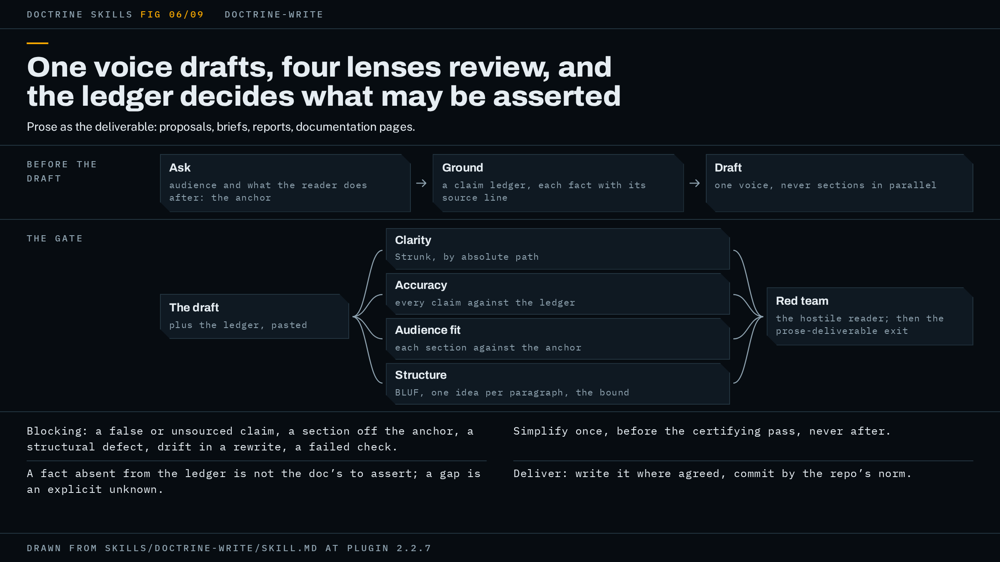

# doctrine-write

Use it when the document itself is the deliverable: a proposal, a brief, a PRD, a handoff or a report that has to be clear, accurate, and airtight, and you want it written or rewritten under the same gate the code skills run.



The figure shows the shape this page walks through: one author, a ledger, a wave of four lenses, a red team, and the gate they feed.

## When to use it, and when not

The trigger is a request for an important document written or rewritten with the doctrine. The description names proposals, briefs, PRDs, handoffs and reports, and it reaches any prose deliverable where a wrong sentence costs something.

It has two modes. In authoring mode the run writes the document from source material you supply. In rewrite mode your existing text enters as draft 1 and the run keeps your meaning: it tightens the words and does not change the claims. The difference matters at the gate, because in rewrite mode a change to what a sentence claims is a defect, not an improvement.

Two neighbours own adjacent work. `doctrine-docs` owns sweeps of a codebase's documentation against its implementation. `doctrine-research` owns producing researched content, the multi-source question that needs a fact-checked answer. `doctrine-write` is for when the writing is the deliverable, and the spec says to chain it after either of those when you have both a research job and a document to write from it.

It is not for quick edits or informal messages. A single clarity pass covers those, and the gate here costs more than a message is worth.

## What it asks you first

Before drafting, the run asks what your request left open. Expect questions on:

- Audience, and what the reader should know or do afterward. Your answer is written down verbatim as the document's anchor, and every review lens later grades sections against it.
- Register, format and length.
- Source material, and whether the run may use web sources. It may not unless you say so.
- Destination: where the finished file lands.

For the highest-stakes documents it offers a judge panel: two or three candidate drafts in different structures, each written whole by one agent, then a fresh-context judge that sees the drafts under neutral filenames and grades on one question, which structure gets this reader to what they must know or do, and what each losing draft does better. The panel is off by default because it triples drafting cost. If you take it, it runs after the ledger is built, not at the questions step, since every draft needs the ledger and the settled register, format and length to draft against.

The hub's rule on questions applies (doctrine step 1): a question only you can answer, where the work would be aimed differently depending on the answer, blocks the phase and never becomes a default.

## How the work runs

The wrapper maps the hub's posture onto seven steps of its own.

1. Ask, as above, and record the anchor.
2. Ground. The run builds a claim ledger from your source material: every fact and number the document may assert, each with its source line, in enough detail that someone holding the ledger and not the sources could check the document against it. A fact the ledger does not carry is not the document's to assert. A gap in the sources becomes an explicit unknown in the document, never a plausible guess.
3. Draft in one voice. The orchestrator writes the draft directly rather than handing sections to parallel agents, because stitched sections produce Frankenstein prose. The doctrine's parallelism belongs in review. The judge panel is the one exception, and it keeps the rule: each panel agent writes a whole draft, and only one survives, so no delivered sentence has two authors. Rewrite mode skips this step.
4. Review wave. Four independent lenses run in parallel, none of them the author. Findings are merged, deduplicated and applied.
5. Red team (doctrine step 4). After the wave has passed the document, an adversary reads the whole thing as a hostile reader.
6. Loop to the hub's gate (doctrine step 5) until it exits.
7. Deliver (doctrine step 7). The document is written to the destination you agreed at step 1. That agreement is the authorization to write, and the run does not ask again. Whether it commits follows your repository's delivery norm: where the norm is to commit, it commits its own paths; where the norm is a patch handoff, it hands you the diff and says so. An unrelated dirty file in your tree is not a reason for it to stop. In chat you get the document's one-line thrust plus anything that needs your judgment.

## What the gate is for this shape

The gate is the hub's full three parts, and the wrapper says what fills each.

Native checks (doctrine step 3) are every check your project documents as a gate for the place the document lands: a prose or markdown linter such as `vale` or `markdownlint`, a docs build, a link, spelling or frontmatter check, whatever your `CLAUDE.md`, README, review checklist or task runner lists. The run reads `package.json` scripts or their equivalent itself rather than trusting a summary, since a project with no build step still has gates. On top of those it runs the doctrine's docs-diff form: re-verify every edited claim against its source, then run a link and path check over the result. Where the destination has no tooling around it at all, the docs-diff form is the whole of native checks, and the spec calls that a complete answer rather than a gap. Because a document does not execute, the docs-diff check is also what stands in for the hub's real-environment run.

The designated review is the four-lens wave:

- Clarity applies Strunk's rules through the `writing-clearly-and-concisely` skill and returns findings with line references.
- Accuracy checks every checkable claim against the ledger and the sources. An unsourced claim is cut or moved to unknowns. In rewrite mode an unsourced claim in your own text is flagged rather than cut, put to you when the lens returns, and your ruling is recorded in the ledger where the next loop's lenses read it. This lens also diffs a rewrite against the original for semantic drift, so it is handed the original text.
- Audience fit asks whether each section serves the anchor, and what this reader would skip, misread or push back on.
- Structure checks for BLUF first, one idea per paragraph, headings that earn their place, and length within the bound you agreed.

The wave is not native checks. The spec is explicit that collapsing the two reports a two-part gate as the full three.

The red team reads the document as the hostile reader: where it got confused, misled or bored, and the strongest case against its conclusion. Every finding is verified against the ledger before anything is changed, because adversarial reviewers produce false positives.

What blocks in a document is narrower than "could be better": a false or unsourced claim, a section that does not serve the anchor, a structural defect, semantic drift in a rewrite, or a failed check. A sentence that could be shorter and means the right thing is not a finding. The bar is what the reader does next, never the polish of the wording. Which bucket a finding lands in follows the hub's three-bucket rule unchanged.

The exit is the hub's prose-deliverable exit, adopted by name. A phase exits on one clean pass of the full gate. Where no pass has come clean by the round alarm's first firing (every fourth round that found a blocker, unless you set a different figure), the run takes one closing round scoped to the diff since the last fully reviewed revision, then ends as Exited with a punch list of what it did not fix, named in the record and in the delivery line. That first firing still puts its diagnosis to you, and the closing round starts without waiting for an answer; say stop if you do not want it to run. The time alarm, two hours by default, still stops the loop for your decision. The spec calls out one hub rule as biting hardest in prose: simplification runs once, before the pass that certifies the document, as a pass that deletes redundancy and decoration, and never again after it, because a simplification landed after the certifying pass ships uncertified.

The anchor and the claim ledger are two artifacts in one file, built before a word is drafted and handed to every lens, the red team, the panel if it runs, and any agent that touches the document. The file lives beside the destination as `<doc>-ledger.md`, or in your project's own place for working notes, or in the session's scratchpad where the repo is not writable or you do not want working files in it. The report names its path, and at delivery the run asks whether it ships with the document or is dropped. It is amended, never frozen: later sources, your rulings on flagged claims, and every red-team finding verified or refuted go into it, with run state under a trailing orchestrator-only heading that no reviewer is handed. Its contents are pasted into each lens prompt, never pointed at, since a lens cannot open a path nobody resolved for it. An accuracy lens handed a draft alone reports that the claims look sourced, which is what an invented fact looks like too.

## A worked example

This example is illustrative: it shows the shape of a run, not a recorded one.

You ask for a handoff document for a service another team is inheriting, and you have the service's README, its runbook and a page of your own notes. The run asks who the reader is and what they should be able to do afterward; you answer "the on-call engineer on the receiving team, able to restart the service and roll back a deploy without calling us." That sentence goes verbatim into `docs/handoff-ledger.md` as the anchor, with the round alarm at its default of 4 and the time budget at its default of two hours. You decline the judge panel. You say the run may not use web sources, and that the document lands at `docs/handoff.md`.

The run builds the ledger from the three sources: each restart command, each rollback step, each port and each owner, one line each with its source line. Your notes mention a rate limit with no figure. That goes under Unknowns, and the draft says the limit is not recorded rather than guessing one.

The draft is written in one voice. The run resolves `elements-of-style.md` to its absolute path and dispatches the four lenses in parallel, each prompt carrying the draft, the anchor, the ledger, the agreed register and length, and the hub's blocking definition. Accuracy returns that one rollback step cites a flag the runbook does not name; that is a false claim and blocks. Audience fit returns that the history section does not help the on-call engineer do either task; that section is cut. Clarity and structure return non-blocking items that are applied. The run repairs the draft, then dispatches the red team with the repaired draft, the anchor and the ledger. It returns the strongest case against the document: the rollback procedure assumes the previous image is still present. The run checks the runbook, finds the retention rule there, and adds one sourced sentence. Because that repair changed a claim, the next round is a full pass over the repaired revision.

This project has no documented prose tooling, so native checks are the docs-diff form: every edited claim re-verified against the runbook and README, and a link and path check over the result. The second round's lenses and red team come back with no blocking findings, the round's checks are on record, and the simplification pass has already run. The run writes `docs/handoff.md`, and since the repository's CLAUDE.md says work lands as a commit, it commits that file and the ledger's path is named for your decision.

The report opens with the gate line, in the form the README shows:

```text
Gate: clean pass on 4a3e4ca, real run on record. No blockers open.
```

Under it, the shape the spec asks for: the document's one-line thrust, the ledger path and the question of whether it ships, a note that the clarity lens ran the installed skill rather than the inline fallback, the one Unknown the reader will see in the document, and the deferred list of non-blocking items not applied. Had the loop reached round 4 without a clean pass, the closing round would have run over the diff since the last fully reviewed revision and the line would instead name that ending: Exited, with the punch list of what the phase did not fix, in a wording the README says varies.

## How to invoke it

The description fires on a request for an important document written or rewritten with the doctrine. One sample prompt:

```text
use doctrine-write to rewrite docs/proposal.md for the finance committee; keep every claim, sources are in docs/proposal-sources/
```

Naming the reader and the sources in the prompt shortens the questions step; the run still records your words as the anchor before it drafts.

## Requirements

Nothing must be installed. Two optional skills change what fills a seat, and the report says which it got.

- `writing-clearly-and-concisely` (Strunk's Elements of Style as a skill, by Josh Thomas via softaworks). With it, the clarity lens is handed the absolute path to `elements-of-style.md` and told to read it; the path rather than the text, because the file runs to over 12,000 words. Without it, the lens gets Strunk's core rules inline: omit needless words, active voice, definite concrete language, one idea per paragraph. A lens working from remembered Strunk returns findings that look like a real pass, which is why the report must say which of the two it ran.
- The OpenAI codex plugin, with the Codex CLI logged in, supplies the different-model red team. Without it the hub's fallback applies: a fresh-context subagent prompted to refute the document, with the verify-from-source rule in its brief. That substitute is same-model, its blind spots correlate with the author's, and the exit statement names it as a substitution.

Install commands and what happens when each is missing are in [docs/requirements.md](../requirements.md). To watch the lenses and the red team work as they run, see [watching a run](../watching-a-run.md).

## Red flags

The spec lists the ways a run goes wrong. In reader terms, stop and ask if you see any of these:

- A lens reports the claims look sourced, and its prompt carried the draft but no ledger.
- The clarity lens is quoting Strunk from memory because nobody resolved the skill's path.
- A number appears in the document that no line of the ledger accounts for.
- Every loop tightens one more sentence and the phase never closes.
- A rewrite improved a claim instead of the words carrying it.
- The document landed in a repo whose docs linter nobody ran.
- By the third loop the anchor and the round counters exist only in the conversation, not on disk.
- Sections were drafted by parallel agents and stitched together.

The hub's page is [doctrine.md](doctrine.md), and the README is [here](../../README.md).

The specification is [`skills/doctrine-write/SKILL.md`](../../skills/doctrine-write/SKILL.md); trust it over this page wherever the two disagree.
