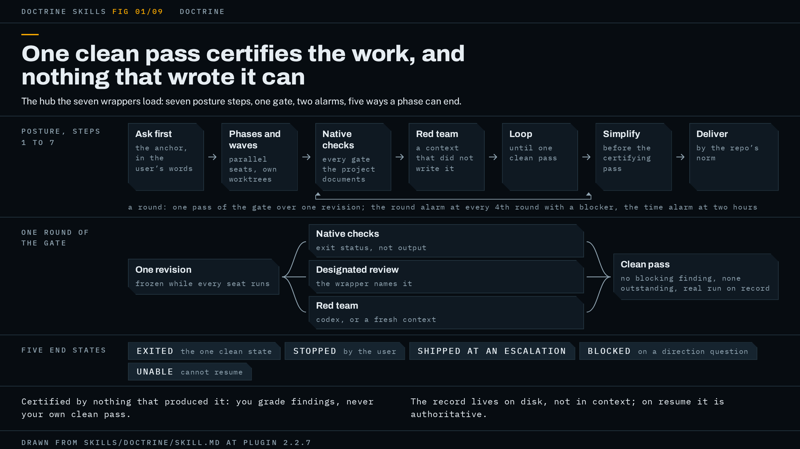

# doctrine

The shared posture every doctrine-* wrapper runs on: what the work is judged by, the checks that prove it, and the loop that will not call a result clean until an outside reviewer has passed it.



The figure shows the shape of one phase: seats, gate, loop, and the end states the loop can reach.

## When to use it, and when not

You do not normally invoke this skill yourself. The seven wrappers (`doctrine-code`, `doctrine-debug`, `doctrine-audit`, `doctrine-docs`, `doctrine-research`, `doctrine-write`, `doctrine-gauntlet`) load it, and each of them supplies what this file leaves open: the core discipline for the task, the review skill the phase gate uses, the axes the red team attacks on, and where the run's record lives. `doctrine-pane` cites it but is not a wrapper and does not load the posture.

Use it directly when your task fits none of the seven shapes and you still want the gate: parallel seats, an adversary that did not write the work, a loop that exits on one clean pass, and a report that says what it certified. Ask for the work "with the doctrine" and the hub runs the phase without a wrapper; the review slot a wrapper would name is then filled by a fresh-context review of the deliverable against your own words.

Do not use it for a one-off question or a single-file edit. The gate costs more time and tokens than a single pass, and the spec's own description excludes those two cases. If a wrapper fits, use the wrapper: its page is one of the other eight linked from the [README](../../README.md).

## What it asks you first

Before any work is aimed, the agent needs a standard in your words. Three things come out of that exchange.

**The anchor.** Your own words for what the work is for and how it will be judged, verbatim, never the agent's paraphrase. If nothing needs asking, the anchor is your request as you typed it. Every reviewer and red-team seat later receives it, because a reviewer without it grades the deliverable against itself.

The agent asks only questions it cannot default. A direction question is one only you can answer, where the work is aimed differently depending on the answer; left unanswered it blocks the phase and never turns into a guess. Where several answers are defensible and the result is acceptable under each, the agent takes the narrower reading of what it changes and records the readings it rejected for the report. A missing value inside a settled direction does not stop the run: the agent builds what holds it and leaves a visible gap, a labelled placeholder or an explicit "unknown" that the delivery line names.

**Two figures.** The loop has two alarms, and the anchor records the bound each fires on: a round count, default 4, and a time budget, default two hours. Give your own figures if you want different ones. The source gives no syntax for stating them; say them in the request and they go in the anchor.

**The record.** A file on disk, opened at this step and written to by every later one. It lives where the wrapper says, and where no wrapper names a place, beside the work in your repo, excluded from version control and from every reviewer's diff and search. The report names its path. The spec does not name the file, so what you will see is a path in the report, not a fixed filename. Everything that decides the outcome goes there so a compaction or a crash loses none of it, and a resumed session reads phase state, counters and open findings from it rather than from memory.

## How the work runs

Seven steps. Steps 3 to 6 repeat as a loop; the spec calls each pass a round.

**Step 1.** The questions above, the anchor, the two figures and the record. You see questions, or nothing if your request was already the standard.

**Step 2.** The agent splits the job into phases, each with a checkable exit, and dispatches independent work as parallel seats. Whether a phase earns the full gate is decided by reach, not size: the agent searches for the callers, readers and consumers of what it changes, and a one-line change to a shared contract earns the gate while a sweep nothing reads may not. An inconclusive search keeps the gate. Work shown small is certified once, by native checks and one outside review, with any blocking finding from that review repaired and the review re-run on the repair, and the record says it was judged small. Each seat that edits gets its own worktree, output directory and port. What you see is a quiet terminal while seats run; [watching-a-run](../watching-a-run.md) says how to get a pane per seat.

**Step 3.** Every phase ends with native checks: every check your project documents as a gate in its CLAUDE.md, README, contributing guide, PR template or task runner, not only the ones an agent would think of. The check list, the review guidance and the documented law that judge a phase are read at the fixed point the phase started from, so a diff cannot be judged by a gate it just loosened: a check the diff adds or tightens runs and counts, and one it loosens or removes, in the listing that names it or in its own code, is reviewed as a change to the gate rather than applied as the gate. The agent reads the task runner itself, confirms each command exits (a `"test": "vitest"` script is watch mode, so it runs the non-interactive form and records the substitution), and treats a runner that exits 0 having collected nothing as a failed check. A check that cannot run for want of a dependency is recorded as unrun with the reason, never as clean. A check already red at the revision the work started from is attributed, not waived: recorded red there, with the same command on the untouched revision as evidence, compared on which checks failed and not on whether the command did. It does not block this phase unless your diff makes it fail differently or more, or the gate sits inside the deliverable, and either way it is still named in what shipping would mean. Before any pass is clean, one complete path has run end to end in the environment the work ships to or the nearest one that runs the real code, run so the change's effect is observed and not only its route traversed, and the record names the path and its output; a unit-test fake does not count, and where no environment that runs the real code is reachable the record says so and the pass carries the run as unrun. For a docs-only change, this step is re-verifying every edited claim against source plus a link and path check.

**Step 4.** A red team that did not produce the work attacks the phase's diff or findings. With the OpenAI codex plugin installed that is a different model, the `codex:codex-rescue` subagent; without it, a fresh-context subagent told to refute the work, and the report names it as a same-model substitute. The seat is handed the artifact itself, your anchor, the blocking definition, its axes, the questions you have ruled closed, and a bound that it reports and never edits. Its return must separate blocking from non-blocking and list what it attacked and could not break; a "no findings" with no attack list counts as a failed seat. Every finding is verified from source before anyone acts on it.

**Step 5.** The loop. The agent repairs blocking findings, asks the class question of each one, and runs the gate again on the repaired revision until one pass comes back clean or an alarm stops it. The gate is the next section.

**Step 6.** A simplification review before the pass expected to certify the shipping revision, so its diff is inside what that pass covers: `/ponytail-review` where installed, otherwise `/simplify` or a YAGNI pass that deletes dead branches and speculative abstractions.

**Step 7.** Delivery by your project's norm, commit or PR per its CLAUDE.md, never a report that ends at "the loop is clean". The agent pushes only where that norm says to or you said to, and where it cannot write where the work must land it builds outside and hands you the diff. The report opens with the delivery line and closes by walking your original request item by item.

## What the gate is

One full pass of the gate has three parts: the native checks of step 3, the designated review the wrapper names (or the fresh-context review against the anchor when there is no wrapper), and the red team of step 4. The report names what filled each slot.

**The clean-pass test.** A pass is certified against one identified revision; a change before every seat has returned voids it. It is clean when it produces no blocking finding, leaves none outstanding from any earlier pass whoever raised it, and the real-environment run is on record for that revision.

**What blocks.** A finding blocks when someone acting on the deliverable as it stands would do the wrong thing. That test comes first and the instances follow: a failed check, a defect, a false claim about what the product does in something that ships, a violation of your brief or your project's documented law, a seam the change introduces or crosses with no test, or work that misses the anchor's bar. Three things never block: a statement about the loop's own instruments (a count, a round number, a commit message), wording whose meaning is correct however imprecise, and a steering document (the spec, your anchor, the decision log, the record) in that role; a spec or report that is the deliverable blocks like any other. A check the deliverable itself ships is not one of the loop's instruments: a false comment inside it describes product behaviour and blocks. A finding the agent cannot yet grade is graded by step 1's test above, and only the case that is acceptable under each answer stays non-blocking. Non-blocking improvements go on a deferred list you see at delivery. A finding you decline is ruled closed and later reviewers are told so. A red-team claim verified false from source is refuted, with the evidence recorded.

**Repairs.** A certified revision stays certified through a repair to wording, a comment, a test, a gate instrument or a steering document, unless that repair loosens or removes a check, which needs its own clean pass like any repair to shipping code. A repair to a non-comment line of shipping code, or to a claim about what it does, needs its own clean pass, and the agent judges which from the diff, not from a label. The next pass takes the repair as its first target: half of the blocking findings on record landed inside the previous round's repair.

**The class question.** Every blocking finding that survives verification is asked where else whatever produced it would have left the same mark, and whether a check exists for its class. The fix goes to every site the question turns up that the agent may touch, and a class a script can catch is caught by that script every round after.

**Five end states.** A phase ends as Exited, the only clean one; Stopped, when you end the loop with findings open; Shipped at an escalation, when you choose to deliver from an alarm's stop or the prose-deliverable exit's closing round delivers; Blocked, when a session ends with a direction question unanswered; or Unable, when execution ended and cannot resume by itself. A phase still running is Open. The four non-clean endings reach you as what they are, never as certified.

**Two alarms.** The round alarm counts rounds that found a blocking finding and stops at every multiple of your figure, default 4. The time alarm stops when the time since the last round closed, or since the phase opened if no round has closed, exceeds your budget, default two hours. Either one stops the loop and puts a diagnosis to you, in three parts: what shipping now would mean (defective or not, each open blocker as its consequence for a user, each unrun gate, and what continuing would cost), why the loop has not closed (which artifacts the findings landed in, whether the class question found other sites), and whether the exit is reachable at all. That last part matters when the gate has stopped discriminating: several adversarial seats over a long prose deliverable return a blocking finding every round however good it gets, and in that case the agent proposes a narrower blocking definition for you to rule on. You are asked to continue or ship. A standing "continue" or "do not ask" given in advance does not switch the alarms off; only a ruling given after one fires restarts the loop. This exit and these alarms are the hub's default. A wrapper replaces them only by stating its own exit, counters and reason: `doctrine-gauntlet` does, and the prose wrappers adopt the hub's prose-deliverable exit, under which the round alarm's first firing still puts its diagnosis to you but the closing round opens without waiting for your ruling unless you say stop. Each wrapper's page says which exit it runs.

## A worked example

This example is illustrative: it shows the shape of a run, not a recorded one.

You type: `with the doctrine: /api/records returns 500 when a record has no owner. Return the record with the owner field empty instead.` This task fits `doctrine-debug`, and in practice you would type `use doctrine-debug` for it; the example runs the bare hub only to show which slot the hub fills on its own when no wrapper names a review.

**Step 1.** The agent asks one direction question: empty as `null` or as an empty string, since callers are aimed differently by the answer. You say `null`. The record opens at `.doctrine/record.md` beside the work, gitignored, and its first part holds your request and your answer verbatim. You gave no figures, so the anchor records the round alarm at 4 and the time budget at two hours.

**Step 2.** One phase. The agent searches for callers of the record serializer and finds the JSON endpoint and a CSV export that share it, so the change has reach and earns the full gate. One builder seat runs in its own worktree.

**Step 3.** The agent reads `package.json`: `"test": "vitest"` is watch mode, so it runs `vitest run` and records the substitution, then `eslint .` because the README lists lint as a gate. Both exit 0. It starts the dev server, requests a record with no owner over the wire, and pastes the response into the record as the real-environment run.

**Step 4.** The codex plugin is installed, so the red team is `codex:codex-rescue`, handed the diff verbatim, the anchor, the blocking definition, the axis "does every consumer of the serializer survive a null owner", and the non-mutating bound. It returns one blocking finding: the CSV export still throws on `null`. The agent verifies it from source. True.

**Step 5, round 1.** The class question: where else would the same mark be? The agent finds a third consumer, an audit log formatter, with the same call. The fix goes into the shared serializer rather than the endpoint, which clears all three. Round 1 closed with a blocking finding, so the round alarm's count is 1.

**Step 6.** `/ponytail-review` runs on the diff before the certifying pass; it removes a helper the repair introduced that one call site did not need.

**Step 5, round 2.** The repair touched shipping code, so it needs its own pass. Native checks rerun and pass. The red team is pointed at the repair diff first, then the whole. It returns no blocking finding, one non-blocking naming suggestion, and a list of what it attacked. The fresh-context review against the anchor fills the designated-review slot, since this run has no wrapper to name one, and returns nothing blocking. The real run is on record for revision `f30a9b7`. Clean pass. The record's last state line reads Exited.

**Step 7.** The repo's CLAUDE.md says commit locally, no PR, so the agent commits and does not push. The report opens:

```text
Gate: clean pass on f30a9b7, real run on record. No blockers open.
```

Then, in order: the record's path and its state; what filled each slot (native checks: `vitest run` and `eslint .`; review: fresh-context against the anchor; red team: codex); no unrun gates and no substitutions; the deferred list (the naming suggestion); and the walk of your request, one item, landed in the shared serializer with the CSV export and audit log covered by the class question.

Had round 4 closed without a clean pass, you would have seen the alarm's three-part diagnosis and a choice to continue or ship; shipping then opens the report with the other form:

```text
Gate: shipped at an escalation, round 4, zero clean passes. Open: 1 blocking finding.
```

The wording of the line varies. What it always does is separate a clean pass from an ending without one and name what is still open.

## How to invoke it

The skill fires when a doctrine-* wrapper invokes it, or when you ask for work done "with the doctrine". For most tasks you type the wrapper's prompt, in the form the README shows:

```text
use doctrine-audit on src/whatever.ts (scope is that file only)
```

and the wrapper loads this skill for you. To run the hub with no wrapper:

```text
with the doctrine: <your request, with any round count or time budget you want>
```

## Requirements

Nothing must be installed; seven of the nine skills, this one included, run with no prerequisites. Each external skill the hub names has a fallback, and a run that uses one says so in its exit statement. [docs/requirements.md](../requirements.md) has the install commands.

| Missing | What happens |
|---|---|
| codex plugin | A fresh-context subagent is prompted to refute the work, with the verify-from-source rule; the report names it as a same-model substitute |
| ponytail | `/simplify` or a manual YAGNI pass on the run's own diff; a non-mutating manual read for an audit lens |
| matts-code-review | `/code-review`, or two parallel subagents (Standards, Spec) handed the same inputs; without Matt's file on disk the seat runs on documented standards alone and the report says so |
| Matt's `tdd` | Inline red-green-refactor |
| Matt's `diagnosing-bugs` | Inline: reproduce first, regression test before the fix |
| Matt's `implement` / `improve-codebase-architecture` | Read `~/.claude/skills/<name>/SKILL.md` if present, otherwise the wrapper's inline fallback |
| superpowers | Parallel Agent tool calls, each prompt assembled rather than summarized; the seat pastes its checks and the agent re-runs them; brainstorming becomes an interview with you |
| session-memory plugin | The agent writes the handoff itself |

`matts-code-review` is Matt Pocock's `code-review` installed by you under a new name, because the original collides with Claude Code's own `/code-review`; this plugin does not bundle it. A seat whose tool is installed but fails is retried once in the round and once more in a later round, then substituted for the rest of the phase, with the retries recorded.

## Red flags

The spec has no section by this name. These are the failures its steps exist to stop, and each is a reason to distrust a report that shows it.

- A report that omits a check that could not run, or its reason. A check that could not run and a check that passed look identical in a report that names neither; the spec requires every unrun gate to be named with its reason.
- A pass called clean by the context that wrote the code. Nothing that produced the work certifies it, the agent's own edits included.
- A red team returning "no findings" with no list of what it attacked. That is a failed seat, and no pass is clean on it.
- Green checks over a diff that never ran. Every gate can pass over code that was never executed; the real-environment run must be on record.
- A fix in the one place the round was looking. The class question exists because the same cause leaves the same mark elsewhere, and a round that clears the instance has scheduled the next finding.
- A defect inside the previous repair. Half of recorded blockers landed there, which is why the next pass targets the repair first.
- A counter rebuilt from memory after a compaction. The record on disk is authoritative on resume, and a value believed wrong is corrected by appending, never by starting over.
- A "continue" given in advance that the run treats as permission to pass an alarm. It is not; the alarm fires so a diagnosis reaches you that no earlier instruction could have weighed.
- An ending presented as certified that is not. Stopped, Shipped at an escalation, Blocked and Unable reach you under those names.

How these rules are checked, and what the checks cannot reach, is in [how-this-is-tested](../how-this-is-tested.md).

The specification is [`skills/doctrine/SKILL.md`](../../skills/doctrine/SKILL.md); trust it over this page wherever the two disagree.
